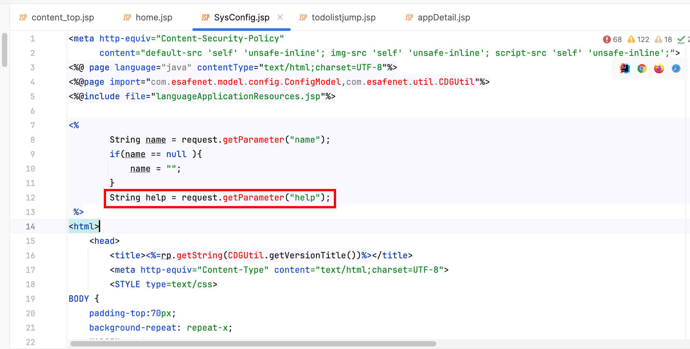
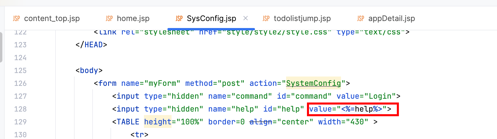

# Vulnerability Report

## Vulnerability Description

The following code (`CDG_SysConfig.jsp`)contains a Cross-Site Scripting (XSS) vulnerability in the `help` parameter. An attacker can exploit this vulnerability to execute malicious scripts in the user's browser, potentially leading to information theft or other malicious activities.

## Vulnerable Code

```jsp
<%
    String name = request.getParameter("name");
    if(name == null ){
        name = "";
    }
    String help = request.getParameter("help");
%>
<input type="hidden" name="help" id="help" value="<%=help%>">
```

## Vulnerability Type

Cross-Site Scripting (XSS)

## Proof of Concept (PoC)

An attacker can trigger the XSS vulnerability through the following URL:

```
https://uri/CDGServer3/SysConfig.jsp?help=<svg/onload=alert()>
```

## Impact

This vulnerability may lead to:

- User information leakage
- Session hijacking
- Execution of malicious code

## Recommendations

1. Implement strict validation and sanitization of user input, especially escaping HTML special characters.
2. Use a secure output encoding library, such as OWASP's Java Encoder, to ensure output content is safe.
3. Implement a Content Security Policy (CSP) to restrict the sources of executable scripts.