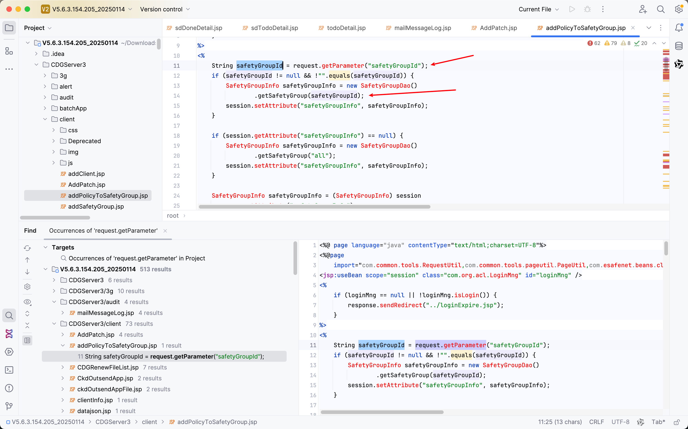

# Vulnerability Report 

**Vulnerability Type**: SQL Injection

**Description**:
The following code(`addPolicyToSafetyGroup.jsp`) contains an SQL injection vulnerability in the `safetyGroupId` parameter. An attacker can exploit this vulnerability to construct malicious SQL queries, potentially accessing or manipulating sensitive information in the database.

**Affected Code**:

```java
String safetyGroupId = request.getParameter("safetyGroupId");
if (safetyGroupId != null && !"".equals(safetyGroupId)) {
    SafetyGroupInfo safetyGroupInfo = new SafetyGroupDao()
            .getSafetyGroup(safetyGroupId);
    session.setAttribute("safetyGroupInfo", safetyGroupInfo);
}
```

**PoC (Proof of Concept)**:
An attacker can exploit the SQL injection vulnerability using the following URL:

```
https://uri/CDGServer3/addPolicyToSafetyGroup.jsp?safetyGroupId=1';WAITFOR DELAY '0:0:10'--
```

This URL will cause the database to execute `WAITFOR DELAY '0:0:10'`, delaying the response by 10 seconds, proving the existence of the SQL injection vulnerability.

**Remediation Recommendations**:

1. Use prepared statements or stored procedures to handle SQL queries.
2. Apply strict filtering and escaping of user input parameters to avoid direct concatenation in SQL queries.
