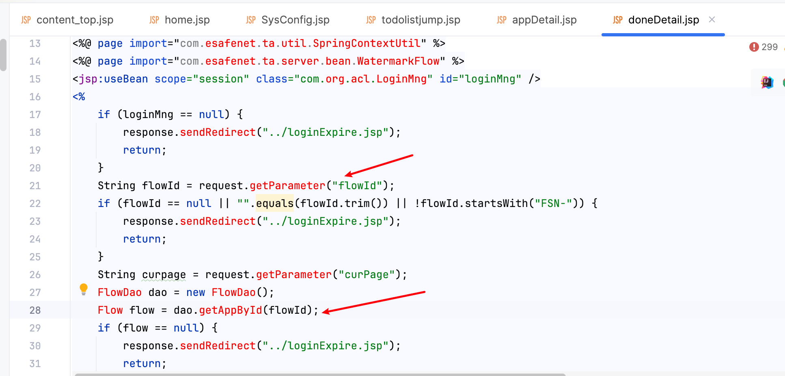

# Vulnerability Report

## Vulnerability Description

The following code (`doneDetail.jsp`) contains an SQL injection vulnerability in the `flowId` parameter. An attacker can exploit this vulnerability to construct malicious SQL queries, potentially accessing or manipulating sensitive information in the database.

## Vulnerable Code

```java
String flowId = request.getParameter("flowId");
…………
FlowDao dao = new FlowDao();
Flow flow = dao.getAppById(flowId);
…………
```

## Vulnerability Type

SQL Injection

## Proof of Concept (PoC)

An attacker can trigger the SQL injection vulnerability through the following URL:

```
https://uri/CDGServer3/doneDetail.jsp?flowId=1';WAITFOR DELAY '0:0:10'--
```

## Impact

This vulnerability may lead to:

- Database information leakage
- Data manipulation
- Unauthorized access to sensitive information

## Recommendations

1. Use prepared statements or parameterized queries to avoid direct SQL string concatenation.
2. Implement strict validation and sanitization of user input to ensure it conforms to expected formats.
3. Apply the principle of least privilege, restricting database user permissions.
