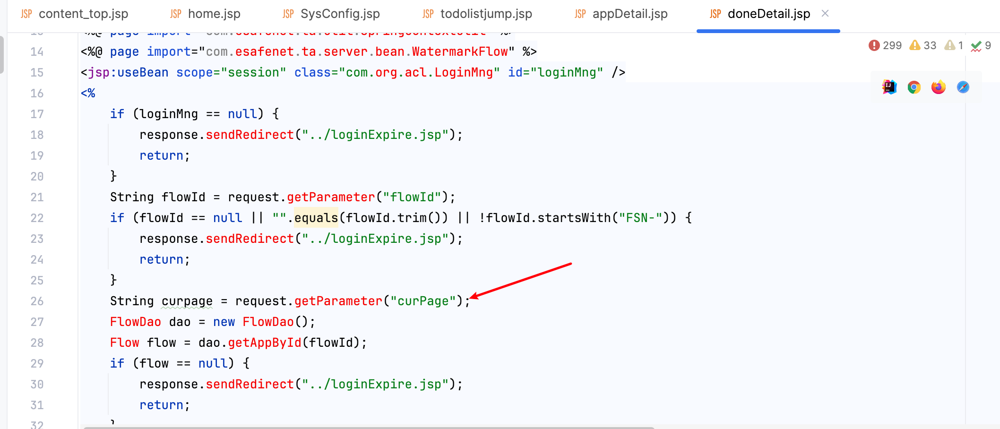
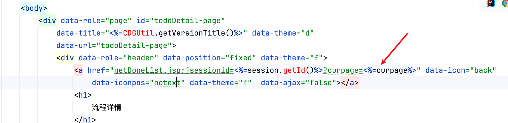

# Vulnerability Report

## Vulnerability Description

The following code(`doneDetail.jsp`) contains a Cross-Site Scripting (XSS) vulnerability in the `curpage` parameter. An attacker can exploit this vulnerability to execute malicious scripts in the user's browser, potentially leading to information theft or other malicious activities.

## Vulnerable Code

```java
………………
String curpage = request.getParameter("curPage");
 ………………
<a href="getDoneList.jsp;jsessionid=<%=session.getId()%>?curpage=<%=curpage%>" data-icon="back"
  data-iconpos="notext" data-theme="f"  data-ajax="false"></a>
```

## Vulnerability Type

Cross-Site Scripting (XSS)

## Proof of Concept (PoC)

An attacker can trigger the XSS vulnerability through the following URL:

```
https://uri/CDGServer3/doneDetail.jsp?curpage="><svg/onload=alert()>//
```

## Impact

This vulnerability may lead to:

- User information leakage
- Session hijacking
- Execution of malicious code

## Recommendations

1. Implement strict validation and sanitization of user input, especially escaping HTML special characters.
2. Use a secure output encoding library, such as OWASP's Java Encoder, to ensure output content is safe.
3. Implement a Content Security Policy (CSP) to restrict the sources of executable scripts.
