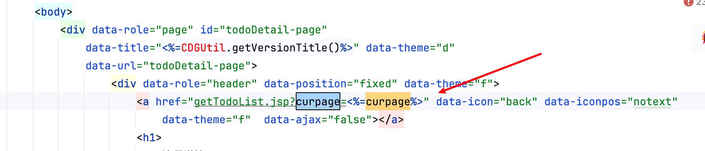

# Vulnerability Report

## Vulnerability Type

Cross-Site Scripting (XSS)

## Vulnerability Description

The `curpage` parameter in the `todoDetail.jsp` interface is not properly validated and sanitized, leading to a Cross-Site Scripting (XSS) vulnerability. An attacker can craft a malicious `curpage` parameter to inject JavaScript code, which can be executed in the user's browser.

## Vulnerable Code

```java
String curpage = request.getParameter("curPage");
…………
<a href="getTodoList.jsp?curpage=<%=curpage%>" data-icon="back" data-iconpos="notext"
  data-theme="f"  data-ajax="false"></a>
```

## POC

An attacker can test the vulnerability using the following POC:

```
https://uri/CDGServer3/todoDetail.jsp?curpage="><svg/onload=alert()>//
```

## Impact Scope

This vulnerability may affect all functionalities that use the `todoDetail.jsp` interface and allow user submission of the `curpage` parameter.

## Remediation Suggestions

1. Strictly validate and sanitize the user input for the `curpage` parameter to ensure it contains only legitimate values.
2. Escape output to HTML to prevent the execution of malicious scripts.
3. Conduct regular security audits and code reviews to identify and remediate potential security vulnerabilities.
